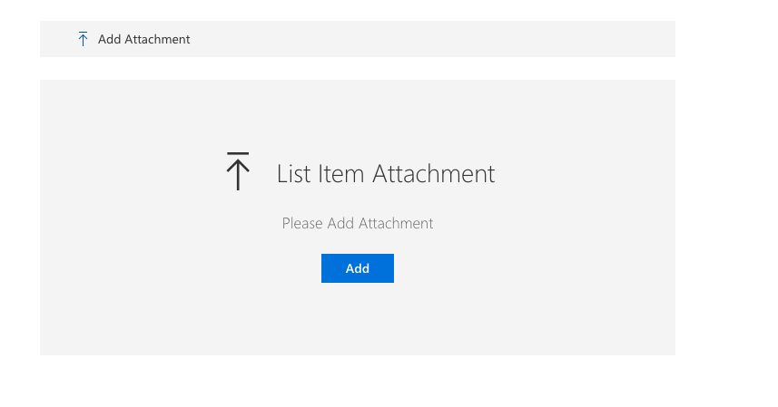

# ListItemAttachments control

This control allows you to manage list item attachments, you can add or delete associated attachments. The attachments are listed in tile view.

Here is an example of the control:




## How to use this control in your solutions

- Check that you installed the `@pnp/spfx-controls-react` dependency. Check out the [getting started](../../#getting-started) page for more information about installing the dependency.
- Import the control into your component:

```TypeScript
import { ListItemAttachments } from '@pnp/spfx-controls-react/lib/ListItemAttachments';
```

- Use the `ListItemAttachments` control in your code as follows:

```TypeScript
<ListItemAttachments listId='dfa283f4-5faf-4d54-b6b8-5bcaf2725af5'
                     itemId={1}
                     context={this.props.context}
                     disabled={false} />
```

- If you want to use `ListItemAttachments` controls with new form you have to use React.createRef.

Following example will add selected attachments to list item with id = 1

```TypeScript
let listItemAttachmentsComponentReference = React.createRef<ListItemAttachments>();
...
      <ListItemAttachments 
        ref={listItemAttachmentsComponentReference} 
        context={this.props.context} 
        listId="dfcfdb95-2488-4757-b55b-14d94166ad87" 
        itemId={0} />
...
<PrimaryButton text="Save to Item with id 1" onClick={()=>{
        //@ts-ignore
        listItemAttachmentsComponentReference.current.uploadAttachments(1);
      }} />
```

## Implementation

The `ListItemAttachments` control can be configured with the following properties:

| Property | Type | Required | Description |
| ---- | ---- | ---- | ---- |
| context | BaseComponentContext | yes | SPFx web part or extension context |
| itemId | number | no | List Item Id  |
| listId | string | yes | Guid of the list. |
| webUrl | string | no | URL of the site. By default it uses the current site URL. |
| label | string | no | Main text to display on the placeholder, next to the icon. |
| description | string | no | Description text to display on the placeholder, below the main text and icon. |
| disabled | boolean | no | Specifies if the control is disabled or not. |
| openAttachmentsInNewWindow | boolean | no | Specifies if the attachment should be opened in a separate browser tab. Use this property set to `true` if you plan to use the component in Microsoft Teams. |
| onAttachmentChange | (itemData: any) => void | no | Callback function invoked when attachments are added or removed. Receives the updated item data including the new ETag. This is useful when using the control within a form (like DynamicForm) that tracks ETags for optimistic concurrency control. |

## Usage with DynamicForm

When using `ListItemAttachments` within a `DynamicForm` or any component that uses ETags for optimistic concurrency control, you should use the `onAttachmentChange` callback to update the ETag when attachments are modified:

```TypeScript
import * as React from 'react';
import { DynamicForm } from '@pnp/spfx-controls-react/lib/DynamicForm';
import { ListItemAttachments } from '@pnp/spfx-controls-react/lib/ListItemAttachments';

export class MyFormComponent extends React.Component<any, any> {
  private dynamicFormRef = React.createRef<DynamicForm>();

  /**
   * Callback invoked when attachments are added or removed
   * Updates the ETag in DynamicForm to prevent 412 conflicts
   */
  private onAttachmentChange = (itemData: any): void => {
    if (this.dynamicFormRef.current) {
      this.dynamicFormRef.current.updateETag(itemData);
    }
  }

  public render(): React.ReactElement {
    return (
      <div>
        <ListItemAttachments
          listId={listId}
          itemId={itemId}
          context={this.props.context}
          onAttachmentChange={this.onAttachmentChange}
        />
        
        <DynamicForm
          ref={this.dynamicFormRef}
          context={this.props.context}
          listId={listId}
          listItemId={itemId}
          respectETag={true}
        />
      </div>
    );
  }
}
```

This prevents 412 ETag conflict errors when saving the form after adding or removing attachments.


