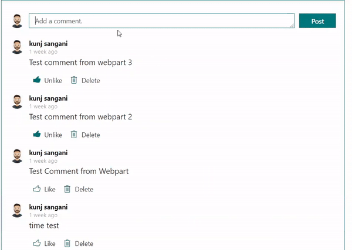
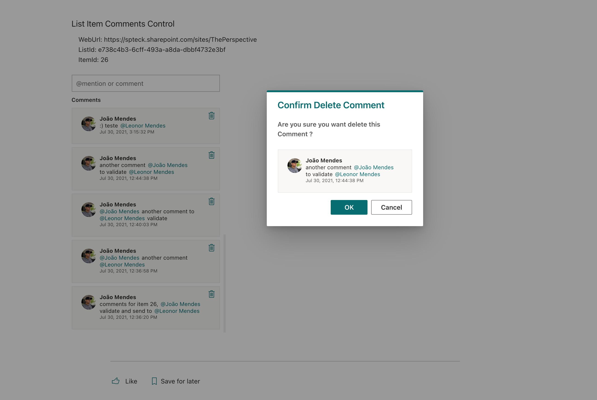
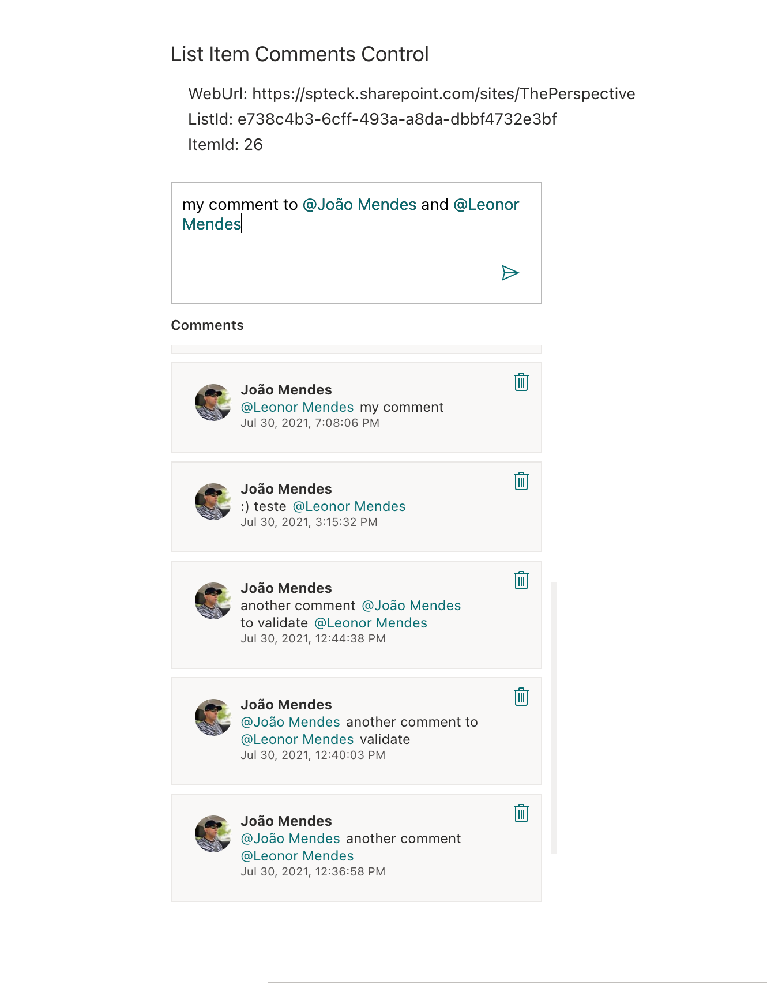
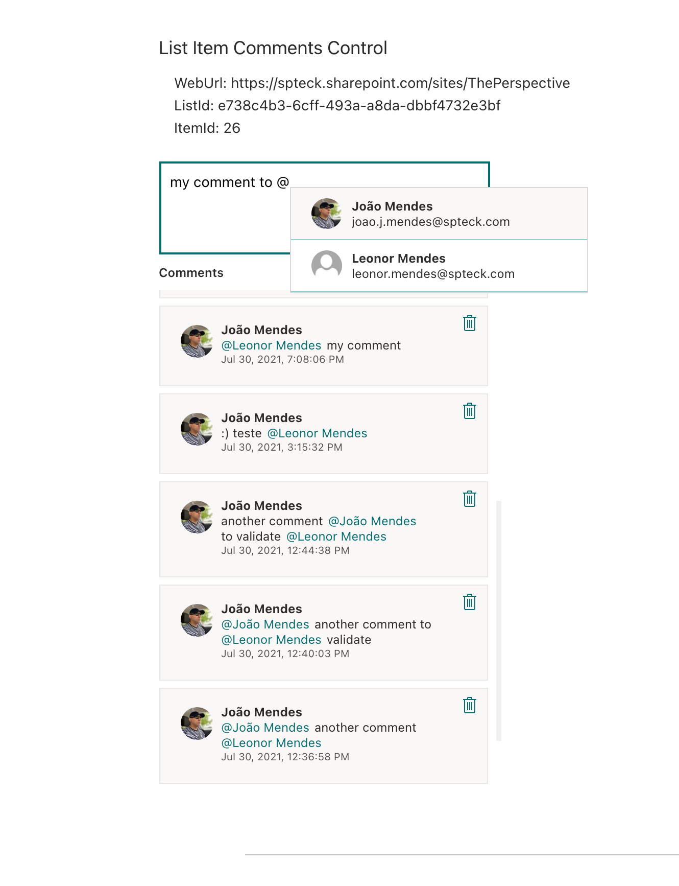
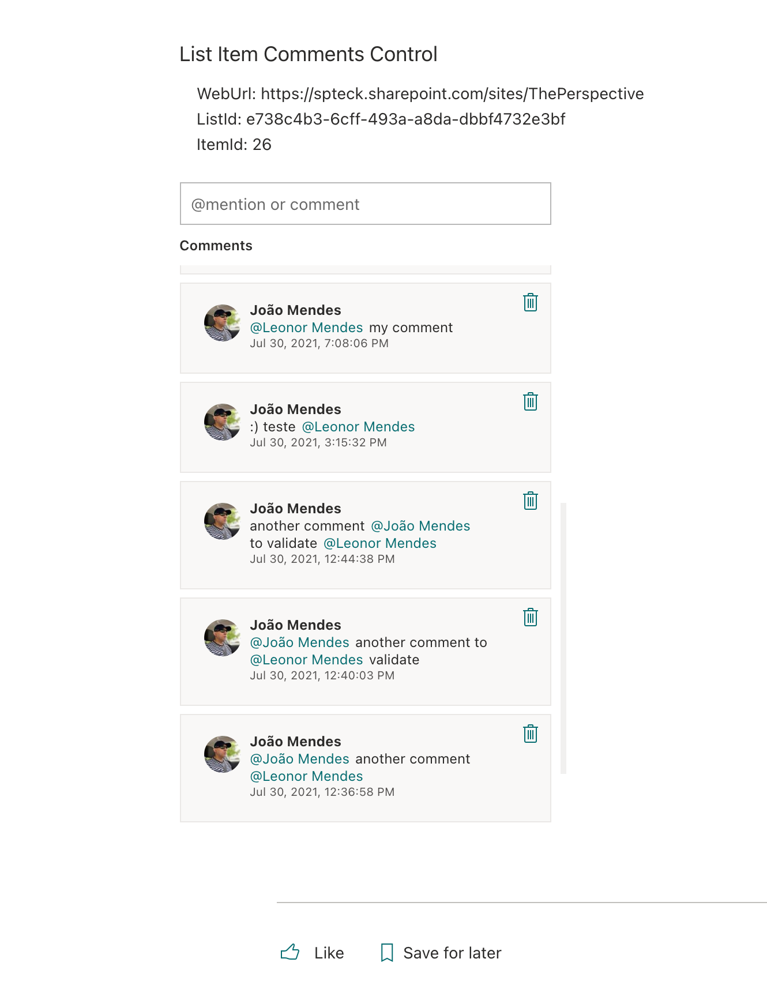

# ListItemComments control

This control allows you to manage list item comments, you can add or delete comments to an item. The comments are listed in tile view.
user can scroll to load more comments if they exist (infinite scroll);

Here is an example of the control:











## How to use this control in your solutions

- Check that you installed the `@pnp/spfx-controls-react` dependency. Check out the [getting started](../../#getting-started) page for more information about installing the dependency.
- Import the control into your component:

```TypeScript
import { ListItemComments } from '@pnp/spfx-controls-react/lib/ListItemComments';
```

- Use the `ListItemComments` control in your code as follows:

```TypeScript
<ListItemComments webUrl='{"https://contoso.sharepoint.com/sites/ThePerspective"}'
                  listId='dfa283f4-5faf-4d54-b6b8-5bcaf2725af5'
                  itemId={1}
                  serviceScope={serviceScope}
                  numberCommentsPerPage={10}
                  label="ListItem Comments"
                  />
```

## Use "highlightedCommentId" parameter to support Comment Notification Link

SharePoint will send a comment notification if someone has been ***"@"*** in the comment. This comment notification mail contains a ***Go to comment*** button.


The "Go to Comment" link is like [https://xxx.sharepoint.com/sites/xxxx/Lists/MyList/DispForm.aspx?ID=1&commentId=1&e=LURoEsg5Zki4cS4SgcIG7w&at=15&CT=1674882847351&OR=OWA-NT&CID=c3a04ee0-40b5-9591-e6a4-3fac33046a64](https://xxx.sharepoint.com/sites/xxxx/Lists/MyList/DispForm.aspx?ID=1&commentId=1&e=LURoEsg5Zki4cS4SgcIG7w&at=15&CT=1674882847351&OR=OWA-NT&CID=c3a04ee0-40b5-9591-e6a4-3fac33046a64), which contains ***commentId*** in url parameter.

The comment whose id is commentId will be highlighted in the OOTB SharePoint List Item page. 
You can use ***highlightedCommentId*** to specify the comment you want to highlight in `ListItemComments` control.

```TypeScript
<ListItemComments webUrl='{"https://contoso.sharepoint.com/sites/ThePerspective"}'
                  listId='dfa283f4-5faf-4d54-b6b8-5bcaf2725af5'
                  itemId={1}
                  serviceScope={serviceScope}
                  numberCommentsPerPage={10}
                  highlightedCommentId={"1"}
                  label="ListItem Comments"
                  />
```

The specified comment will be highlighted with different border and background color (Use theme color).


## Implementation

The `ListItemComments` control can be configured with the following properties:

| Property | Type | Required | Description |
| ---- | ---- | ---- | ---- |
| serviceScope | ServiceScope | yes | SPFx Service Scope.  |
| itemId | number | yes | List Item Id.  |
| listId | string | yes | Guid of the list. |
| webUrl | string | no | URL of the site. By default it uses the current site URL. |
| label | string | no | Label for control. |
| numberCommentsPerPage | number  | no | number of comments per page. Possible values: `5` \| `10` \| `15` \| `20` (default `10`). |
| highlightedCommentId | string | no | The commend Id (e.g. "1") you want to highlight. This selected comment will show with different border and background color based on site theme. |

## MSGraph Permissions required

This control requires at least the following scopes: `People.Read`, `User.ReadBasic.All`.


