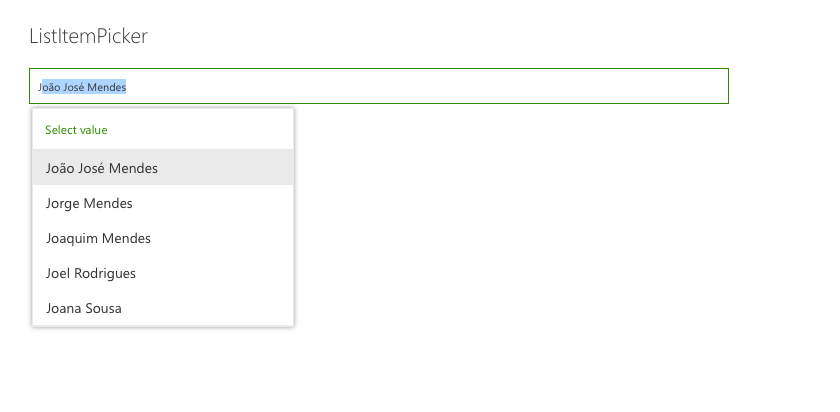
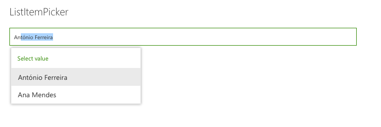
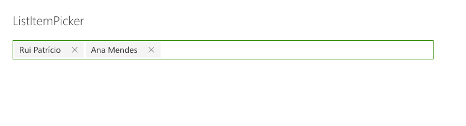

# ListItemPicker control

This control allows you to select one or more items from a list. The item selection is based from a column value. The control will suggest items based on the inserted value.

Here is an example of the control:







## How to use this control in your solutions

- Check that you installed the `@pnp/spfx-controls-react` dependency. Check out the [getting started](../#getting-started) page for more information about installing the dependency.
- Import the control into your component:

```TypeScript
import { ListItemPicker } from '@pnp/spfx-controls-react/listItemPicker';
```
- Use the `ListItemPicker` control in your code as follows:

```TypeScript
<ListItemPicker listId='da8daf15-d84f-4ab1-9800-7568f82fed3f'
                columnInternalName='Title'
                itemLimit={2}
                onSelectedItem={this.onSelectedItem}
                context={this.props.context} />
```

- The `onSelectedItem` change event returns the list items selected and can be implemented as follows:

```TypeScript
private onSelectedItem(data: { key: string; name: string }[]) {
  for (const item of data) {
    console.log(`Item value: ${item.name}`);
  }
}
```
## Implementation

The `ListItemPicker` control can be configured with the following properties:


| Property | Type | Required | Description |
| ---- | ---- | ---- | ---- |
| columnInternalName | string | yes | InternalName of column to search and get values. |
| context | WebPartContext \| ApplicationCustomizerContext | yes | SPFx web part or extention context |
| listId | string | yes | Guid of the list. |
| itemLimit | number | yes | Number of items which can be selected |
| onSelectItem | (items: any[]) => void | yes | Callback function which returns the selected items. |
| className | string | no | ClassName for the picker. |
| webUrl | string | no | URL of the site. By default it uses the current site URL. |
| defaultSelectedItems | any[] | no | Initial items that have already been selected and should appear in the people picker. |
| suggestionsHeaderText | string | no | The text that should appear at the top of the suggestion box. |
| noResultsFoundText | string | no | The text that should appear when no results are returned. |
| disabled | boolean | no | Specifies if the control is disabled or not. |


