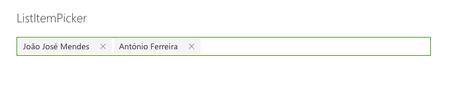

# ListItemPicker control

This control allows you to select one or more  item from list, based in a column value, the control sugest values based on charaters typed 

Here is an example of the control:




 
## How to use this control in your solutions

- Check that you installed the `@pnp/spfx-controls-react` dependency. Check out the [getting started](../#getting-started) page for more information about installing the dependency.
- Import the control into your component:

```TypeScript
 
import { ListItemPicker } from '@pnp/spfx-controls-react/listItemPicker';
```

- Use the `ListItemPicker` control in your code as follows:

```TypeScript
          <ListItemPicker
            listId='da8daf15-d84f-4ab1-9800-7568f82fed3f'
            columnInternalName='Title'
            itemLimit={2}
            onSelectedItem={this.onSelectedItem}
            context={this.props.context}
          />
```

- The `onSelectedItem` change event returns the list items selected and can be implemented as follows:

```TypeScript
private onSelectedItem(data: { key: string; name: string }[]) {
    for (const item of data) {
      console.log(`Item value: ${item.name}`);
    }
  }
```

## Implementation

The `ListItemPicker` control can be configured with the following properties:

<table style="width: 100%; height: 786px;">
<tbody>
<tr>
<th style="width: 220px;">Property</th>
<th>Type</th>
<th style="width: 85px;">Required</th>
<th>Description</th>
</tr>
<tr>
<td>listId</td>
<td>string</td>
<td>yes</td>
<td>Gui of List</td>
</tr>
<tr>
<td>columnInternalName</td>
<td>string</td>
<td>yes</td>
<td>InternalName of column to search and get values</td>
</tr>
<tr>
<td>onSelectedItem: (item:any) =>void;</td>
<td>function</td>
<td>yes</td>
<td>Callback function</td>
</tr>
<tr>
<td>className</td>
<td>string</td>
<td>no</td>
<td>CSS className</td>
</tr>
<tr>
<td>webUrl</td>
<td>string</td>
<td>no</td>
<td>URL of site if different of current site, user must have permissions</td>
</tr>
<tr>
<td>value</td>
<td>Array</td>
<td>no</td>
<td>Default Value</td>
</tr>
<tr>
<td>disabled</td>
<td>Boolean</td>
<td>no</td>
<td>Disable Control</td>
</tr>
<tr>
<td>itemLimit</td>
<td>number</td>
<td>yes</td>
<td>Number os items to select / return</td>
</tr>
<tr>
<td>context</td>
<td>WebPartContext|ApplicationCustomizerContext</td>
<td>yes</td>
<td>WebPart or Application customiser context</td>
</tr>
<tr>
<td>sugestedHeaderText</td>
<td>string</td>
<td>no</td>
<td>Text header to display</td>
</tr>
<tr>
<td>noresultsFoundTextstring</td>
<td>string</td>
<td>no</td>
<td>Text message when no items</td>
</tr>
</tbody>
</table>		


