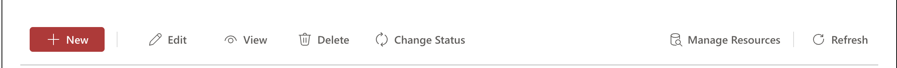
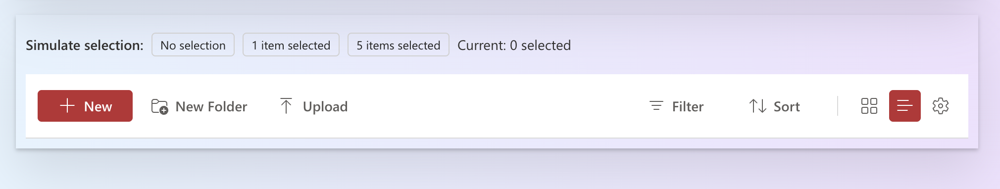
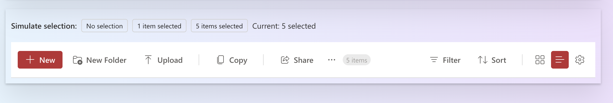
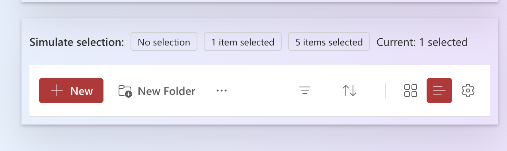

# ListToolbar control

This control renders a flexible toolbar for building list and data grid command bars. It is built with Fluent UI 9 components and supports item grouping, left/right aligned items, dividers, tooltips, automatic overflow menu, responsive design, loading states, and custom rendering.

Here is an example of the control in action:






## How to use this control in your solutions

- Check that you installed the `@pnp/spfx-controls-react` dependency. Check out the [getting started](../../#getting-started) page for more information about installing the dependency.
- Import the following modules to your component:

```TypeScript
import { ListToolbar } from '@pnp/spfx-controls-react/lib/controls/ListToolbar';
import { IToolbarItem } from '@pnp/spfx-controls-react/lib/controls/ListToolbar';
```

- Use the `ListToolbar` control in your code as follows:

```TypeScript
<ListToolbar
  items={[
    { key: 'new', label: 'New', icon: <AddRegular />, onClick: () => console.log('New') },
    { key: 'edit', label: 'Edit', icon: <EditRegular />, onClick: () => console.log('Edit') },
    { key: 'delete', label: 'Delete', icon: <DeleteRegular />, onClick: () => console.log('Delete') },
  ]}
  context={this.props.context}
  ariaLabel="Document toolbar"
/>
```

- With the `farItems` property you can add items that are aligned to the right side of the toolbar:

```TypeScript
<ListToolbar
  items={[
    { key: 'new', label: 'New', icon: <AddRegular />, onClick: () => {} },
  ]}
  farItems={[
    { key: 'filter', label: 'Filter', icon: <FilterRegular />, onClick: () => {} },
    { key: 'settings', icon: <SettingsRegular />, tooltip: 'Settings', onClick: () => {} },
  ]}
  context={this.props.context}
/>
```

- Use the `group` property on items to visually group them with dividers:

```TypeScript
<ListToolbar
  items={[
    { key: 'new', label: 'New', icon: <AddRegular />, group: 'file', onClick: () => {} },
    { key: 'edit', label: 'Edit', icon: <EditRegular />, group: 'file', onClick: () => {} },
    { key: 'copy', label: 'Copy', icon: <CopyRegular />, group: 'clipboard', onClick: () => {} },
    { key: 'paste', label: 'Paste', icon: <ClipboardPasteRegular />, group: 'clipboard', onClick: () => {} },
  ]}
  showGroupDividers={true}
  context={this.props.context}
/>
```

- Use the `totalCount` property to display a count badge in the toolbar:

```TypeScript
<ListToolbar
  items={items}
  totalCount={42}
  context={this.props.context}
/>
```

- Use the `isLoading` property to disable all toolbar items during a loading state:

```TypeScript
<ListToolbar
  items={items}
  isLoading={true}
  context={this.props.context}
/>
```

- Use the `onRender` property on an item for complete custom rendering:

```TypeScript
const farItems: IToolbarItem[] = [
  {
    key: 'search',
    onRender: () => (
      <SearchBox placeholder="Search..." onChange={(e, data) => onSearch(data.value)} />
    ),
  },
];

<ListToolbar items={items} farItems={farItems} context={this.props.context} />
```

### Overflow & responsive behavior

When the toolbar is too narrow to show all left-side items, they automatically collapse into a **"..."** overflow menu. The overflow menu appears right next to the last visible item and lists every hidden action.

On small screens (≤ 768 px), far-item **labels are hidden** and only their icons are shown. The total-count badge is also hidden at that breakpoint.

## Implementation

The `ListToolbar` control can be configured with the following properties:

| Property | Type | Required | Description | Default |
| ---- | ---- | ---- | ---- | ---- |
| items | IToolbarItem[] | yes | Array of toolbar items to display on the left side. | |
| farItems | IToolbarItem[] | no | Items that appear on the right side of the toolbar. | `[]` |
| isLoading | boolean | no | When `true`, all items are disabled. | `false` |
| ariaLabel | string | no | Accessibility label for the toolbar. | `'Toolbar'` |
| totalCount | number | no | Displays a count badge in the toolbar. | |
| className | string | no | Additional CSS class name to apply to the toolbar. | |
| showGroupDividers | boolean | no | Whether to show dividers between item groups. | `true` |
| theme | Theme | no | Fluent UI v8 theme (auto-converted to v9 via `createV9Theme`). | |
| context | BaseComponentContext | no | SPFx component context. Enables automatic Teams theme detection (dark, high-contrast). | |

### IToolbarItem

| Property | Type | Required | Description | Default |
| ---- | ---- | ---- | ---- | ---- |
| key | string | yes | Unique identifier for the item. | |
| label | string | no | Button text label. | |
| tooltip | string | no | Tooltip content shown on hover. | |
| icon | ReactElement | no | Icon element to display. | |
| onClick | () => void | no | Click handler for the item. | |
| disabled | boolean | no | Whether the item is disabled. | `false` |
| visible | boolean | no | Whether to show or hide the item. | `true` |
| group | string | no | Group name — items with the same group are grouped together with dividers between groups. | `'default'` |
| isFarItem | boolean | no | Place the item on the right side of the toolbar. | `false` |
| appearance | ToolbarButtonProps['appearance'] | no | Button appearance style. | |
| onRender | () => ReactElement | no | Custom render function for complete control over item rendering. | |
| dividerAfter | boolean | no | Add a divider after this item. | `false` |
| dividerBefore | boolean | no | Add a divider before this item. | `false` |
| ariaLabel | string | no | Accessibility label override. | |


