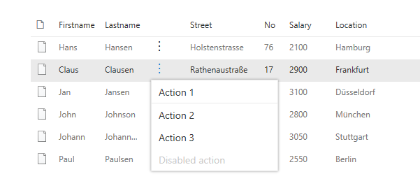
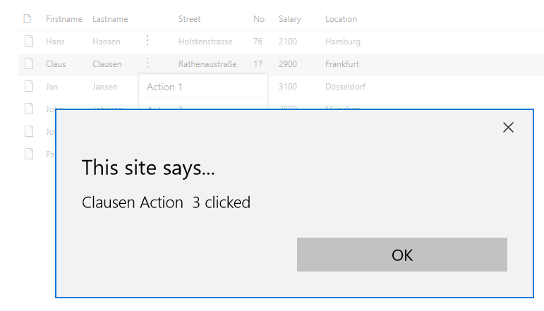

# Add a contextual menu
## The ListView column
To add a contextual menu to our ListView we will insert another Viewfield in the webpart code at the position of our choice, for instance after the “Lastname”:
```TypeScript
{
    name: "",
    sorting: false,
    maxWidth: 40,
    render: (rowitem: IListitem) => {
      const element:React.ReactElement<IECBProps> =React.createElement(
        ECB, {
          item:rowitem
        }
      );
      return element;
    }      
}
```
We use the render method of IViewField. Inside we create our ECB component and as a property we handover the rowitem which is clicked. 
We could also handover functions that shall be executed inside the context menu component but be able to be bound to the parent component, that is the webpart/component which contains the ListView.
## The ContextualMenu component
We now need to create the ECB component which represents our context menu. Therefore we will use a combination of an [IconButton](https://developer.microsoft.com/en-us/fabric#/components/button#Variants) and a [ContextualMenu](https://developer.microsoft.com/en-us/fabric#/components/contextualmenu) from the Office UI Fabric components.
The code for this additional component looks like this:
```TypeScript
import * as React from 'react';
import { Layer, IconButton, IButtonProps } from 'office-ui-fabric-react';
import { ContextualMenuItemType } from 'office-ui-fabric-react/lib/ContextualMenu';
// The following are project specific components
import { IECBProps } from './IECBProps';
import styles from './ECB.module.scss';
import { IListitem } from '../../model/IListitem';

export class ECB extends React.Component<IECBProps, {}> {

  public constructor(props: IECBProps) {        
      super(props);

      this.state = {
          panelOpen: false
      };
  }

  public render() {      
    return   <div className={styles.ecb}>
              <IconButton

id='ContextualMenuButton1'
                className={styles.ecbbutton}
                text=''
                width='30'
                split={false}
                iconProps={ { iconName: 'MoreVertical' } }
                menuIconProps={ { iconName: '' } }
                menuProps={ {
                  shouldFocusOnMount: true,
                  items: [
                    {
                      key: 'action1',
                      name: 'Action 1',
                      onClick: this.handleClick.bind(this, this.props.item.Firstname + ' Action 1')
                    },
[                    {
                      key: 'divider_1',
                      itemType: ContextualMenuItemType.Divider
                    },
                    {
                      key: 'action2',
                      name: 'Action 2',
                      onClick: this.handleClick.bind(this, this.props.item.Firstname + ' Action 2')
                    },
                    {
                      key: 'action3',
                      name: 'Action 3',
                      onClick: this.handleClick.bind(this, this.props.item.Lastname + ' Action  3')
                    },
                    {
                      key: 'disabled',
                      name: 'Disabled action',
                      disabled: true,
                      onClick: () => console.error('Disabled action should not be clickable.')
                    }
                  ]
                } }
              />
            </div>
      ;
  }

  private handleClick(source:string, event) {
    alert(source + ' clicked');
  }
}
```
One of the things to mention is that in the (totally simplified for demo reasons here) onClick function we hand over one attribute of the clicked item that we have in the components' properties so we can process it in the function.
Another trick is to give an empty iconName for the menuIconProps. This is because once you attach a menuProps Attribute to any Kind of Office UI fabric button a ChevronDown selector on the right side of the button will occur by default. 
With the menuIconProps Attribute you can adjust this, that is when specifying an empty Name you can remove it. This is what we want because we only want to have our “MoreVertical” icon which are the three dots in a vertical order.
To place this a bit more centric, we have small CSS manipulation as well:
```SCSS
.ecb {
    position: absolute;
    top: -3px;
    .ecbbutton div {
        padding-left: 12px;
    }
}
```
## The result
The result will look like the following:


And in action it shows which function and item was clicked:


