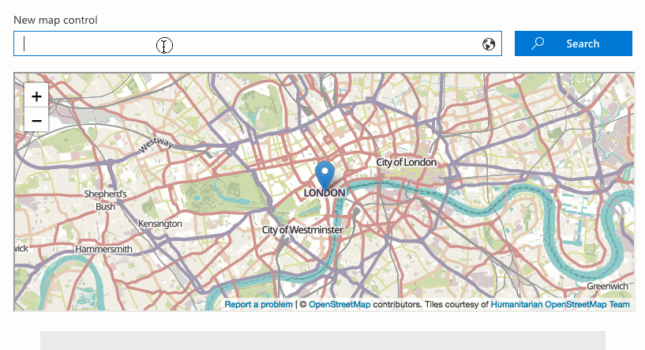

# Map control

This control renders a map in your solution. The control has also the ability to search for new locations.

Here is an example of the control in action:



## How to use this control in your solutions

- Check that you installed the `@pnp/spfx-controls-react` dependency. Check out the [getting started](../../#getting-started) page for more information about installing the dependency.
- In your component file, import the `Map` control as follows:

```TypeScript
import { Map, ICoordinates, MapType } from "@pnp/spfx-controls-react/lib/Map";
```

- Use the `Map` control in your code as follows:

```TypeScript
<Map titleText="New of London"
     coordinates={{ latitude: 51.507351, longitude: -0.127758 }}
     enableSearch={true} />
```

## Implementation

The `Map` control can be configured with the following properties:

| Property              | Type                                | Required | Description                                                                          | Default  |
| --------------------- | ----------------------------------- | -------- | ------------------------------------------------------------------------------------ | -------- |
| titleText             | string                              | no       | Title label to show above the control.                                               |          |
| coordinates           | ICoordinates                        | yes      | Coordinates required for rendering the control.                                      |          |
| enableSearch          | boolean                             | no       | Allow the user to search for new locations.                                          |          |
| zoom                  | number                              | no       | Zoom level for the maps on display (range 1-15).                                     | 10       |
| width                 | number                              | no       | Width of the maps area in percentage.                                                | 100%     |
| height                | number                              | no       | Height of the maps area.                                                             | 300px    |
| mapType               | MapType                             | no       | Type of the map to render.                                                           | standard |
| loadingMessage        | string                              | no       | Custom loading message.                                                              |          |
| errorMessage          | string                              | no       | Custom error message.                                                                |          |
| mapsClassName         | string                              | no       | Custom CSS class name.                                                               |          |
| errorMessageClassName | string                              | no       | Custom CSS error class name.                                                         |          |
| onUpdateCoordinates   | (coordinates: ICoordinates) => void | no       | Callback to let your solution knows the new coordinates when a search was performed. |          |

`ICoordinates` interface:

| Property    | Type   | Required | Description                      | Default |
| ----------- | ------ | -------- | -------------------------------- | ------- |
| latitude    | number | yes      | Latitude of the map to display.  |         |
| longitude   | number | yes      | Longitude of the map to display. |         |
| displayName | string | no       | Display Name of the location.    |         |
| address     | any    | no       | Address of the location.         |         |

`MapType` enum:

| Name      |
| --------- |
| standard  |
| cycle     |
| normal    |
| transport |


