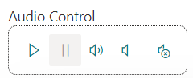
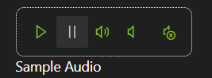

# Modern Audio

This control renders an Audio Control in a modern and themable way. It is controllable with Fluent UI icons instead of old-fashioned standard HTML5 Audio control.

!!! Note
    Originally it's coming from the following community [Teams app sample](https://github.com/pnp/teams-dev-samples/tree/main/samples/tab-meeting-record-name).

- Modern Audio control rendered with label and default label positioning:



- Modern Audio control rendered with dark (lime) theme and label positioned BottomLeft:



- Modern Audio control in action with label positioned at BottomCenter:


## How to use this control in your solutions

- Check that you installed the `@pnp/spfx-controls-react` dependency. Check out the [getting started](../../#getting-started) page for more information about installing the dependency.
- Import the following modules to your component:

```typescript
import { ModernAudio, ModernAudioLabelPosition } from "@pnp/spfx-controls-react/lib/ModernAudio";
```

- Use the `ModernAudio` control in your code as follows:

```typescript
<ModernAudio 
    audioUrl='https://www.winhistory.de/more/winstart/mp3/vista.mp3'
    label="Audio Control"
    labelPosition={ModernAudioLabelPosition.TopCenter} />
```

## Implementation

The Modern Audio control can be configured with the following properties:

| Property      | Type                     | Required | Description                                                             | Default |
| ------------- | ------------------------ | -------- | ----------------------------------------------------------------------- | ------- |
| audioUrl      | string                   | yes      | Url to the audio src                                                    |         |
| label         | string                   | no       | Label to use for the control.                                           | blank   |
| labelPosition | ModernAudioLabelPosition | no       | Define position of label: TopLeft, TopCenter, BottomLeft, BottomCenter. | TopLeft |

Enum `ModernAudioLabelPosition`

The `ModernAudioLabelPosition` enum can be used to specify the types of information you want to query: User, Security groups, and/or SharePoint groups.

| Name         | Value | Position                |
| ------------ | ----- | ----------------------- |
| TopLeft      | 1     | On top, left aligned    |
| TopCenter    | 2     | On top, centered        |
| BottomLeft   | 3     | At bottom, left aligned |
| BottomCenter | 4     | At bottom, centered     |


