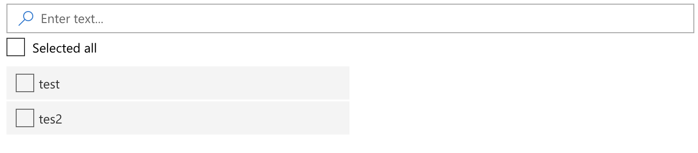
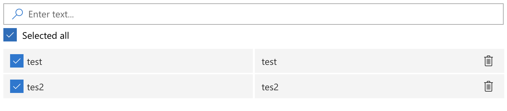
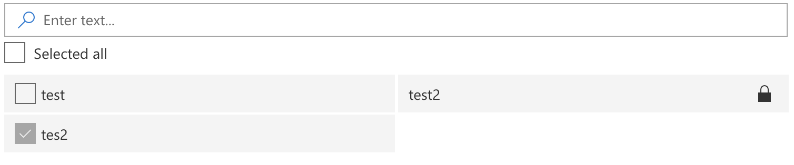

# MultiSelectLookup control

This control renders a few components that help you manage a multi-select lookup in your form.
Control accepts an array of objects or list title with or without sp web object whence download data.




## How to use this control in your solutions

- Check that you installed the `@pnp/spfx-controls-react` dependency. Check out the [getting started](../#getting-started) page for more information about installing the dependency.
- Import the following modules to your component:

```TypeScript
import { MultiSelectLookup, IOnChangeState } from '@pnp/spfx-controls-react/lib/MultiSelectLookup';
```

- Add available data and selected data to your component state.

```TypeScript
constructor(props: IComponentProps) {
    super(props);

    this.state = {
      multiSelectAvailableData: [
        {
          label: "test",
          value: 1
        },
        {
          label: "tes2",
          value: 2
        }
      ],
      multiSelectSelectedData: [],
    };
  }
```

- Use the `MultiSelectLookup` control in your code as follows:

```TypeScript
<MultiSelectLookup onChanged={this.handleChangeMultiSelect}
                    availableData={this.state.multiSelectAvailableData}
                    selectedData={this.state.multiSelectSelectedData}
                  />
```

- Create a handleChange method to capture changes in control.

```TypeScript
  private handleChangeMultiSelect(changes: IOnChangeState) {
    console.log(changes)
  }
```

## Examples
- Available data from the component state.

```TypeScript
  <MultiSelectLookup onChanged={this.handleChangeMultiSelect}
                    availableData={this.state.multiSelectAvailableData}
                    selectedData={this.state.multiSelectSelectedData}
                  />
```


- Available data from the component state with locked items.

```TypeScript
  constructor(props: IComponentProps) {
    super(props);

    this.state = {
      multiSelectAvailableData: [
        {
          label: "test",
          value: 1
        },
        {
          label: "tes2",
          value: 2
        }
      ],
      multiSelectSelectedData: [
        {
          label: "tes2",
          value: 2,
          isLocked: true
        }
      ],
    };
  }
```
```TypeScript
  <MultiSelectLookup onChanged={this.handleChangeMultiSelect}
                    availableData={this.state.multiSelectAvailableData}
                    selectedData={this.state.multiSelectSelectedData}
                  />
```


- Available data from the SharePoint List. List should have columns: Title, Value

```TypeScript
  <MultiSelectLookup
            onChanged={this.handleChangeMultiSelect}
            selectedData={this.state.multiSelectSelectedData}
            listName="lookup_values_list_name"
          />
```


## Implementation

The WebPartTitle control can be configured with the following properties:

| Property | Type | Required | Default Value | Description |
| ---- | ---- | ---- | ---- | ---- |
| className | string | no | | Additional CSS class(es) to apply to the MultiSelectLookup container. |
| id | string | no | | Id of a root element. |
| disabled | boolean | no | false | Disabled state of the component. |
| required | boolean | no | false | Required state of the component. |
| showSearchBox | boolean | no | true | Specifies rendering of the search box. |
| searchPlaceholder | string | no | 'Enter text...' | Placeholder of searchbox. |
| checkboxLabel | string | no | 'Selected all' | Placeholder of searchbox. |
| listName | string | no | | ListName to download datas. List should have columns: Title, Value. Control gets datas from list when this props is provided |
| web | SPWeb | no | | SPWeb using to download datas |
| availableData | Item[] | no | [] | All available data |
| selectedData | Item[] | no | [] | Start selected data (which is included in availableData) |
| onChanged | (value: IOnChangeState) => void | no | () => {} | Function to capture changes in control |

Interface `Item`

| Property | Type | Required | Description |
| ---- | ---- | ---- | ---- |
| label | string or number | yes | The label which will be displayed in rows |
| value | string or number  | yes | The value of object |
| isSelected | boolean | noe | The value used to distinguishing selected items |
| isLocked | boolean | noe | The value used to lock items |
| sort | number | no | The value used to sort items in an array |

Interface `IOnChangeState`

| Property | Type | Required | Description |
| ---- | ---- | ---- | ---- |
| allSelected | boolean | yes | The value represents all selected checkbox |
| selectedData | Item[] | yes | The value represents selected data in control |
