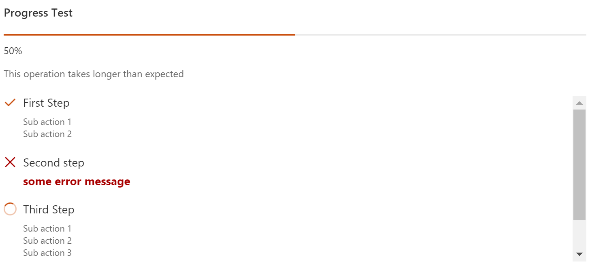

# Progress control

This control shows progress of multiple SEQUENTIALLY executed actions.

Here is an example of the control in action:



## How to use this control in your solutions

- Check that you installed the `@pnp/spfx-controls-react` dependency. Check out the [getting started](../../#getting-started) page for more information about installing the dependency.
- Import the following modules to your component:

```TypeScript
import { Progress } from "@pnp/spfx-controls-react/lib/Progress";
```

- Use the `Progress` control in your code as follows:

```TypeScript
<Progress title={'Progress Test'}
          showOverallProgress={true}
          showIndeterminateOverallProgress={false}
          hideNotStartedActions={false}
          actions={this.state.progressActions}
          currentActionIndex={this.state.currentProgressActionIndex}
          longRunningText={'This operation takes longer than expected'}
          longRunningTextDisplayDelay={7000}
          height={'350px'} />
```

**Note**: the control itself is not responsible for actions' execution. It only renders the actions, overall progress and actions' execution states.
When using the control, you should implement actions execution.
As example, you can have a base class that implements `IProgressAction` interface and has an `execute` method:

```TypeScript
class BaseAction implements IProgressAction {
  public get title(): string { ... }
  public get subActionsTitles(): string[] { ... }
  public get hasError(): boolean { ... }
  public get errorMessage(): string { ... }
  public async execute(): Promise<void> { ... }
}
```

Then, you have multiple actions derived from the base one:

```TypeScript
class FirstAction extends BaseAction {
  public async execute(): Promise<void> { 
    // implementation for FirstAction
  }
}

class SecondAction extends BaseAction {
  public async execute(): Promise<void> {
    // implementation for SecondAction
  }
}
```

Now, in a component, where `Progress` is used you can have code as below:

```TypeScript
export interface IYourComponentState {
  actions: IProgressAction[];
  currentActionIndex?: number;
  // other state properties
}

// ...

export class YourComponent extends React.Component<IYourComponentProps, IYourComponentState> {
  // all other code, including render with Progress reference listed above

  private _initActions() {
    this.setState({
      actions: [
        new FirstAction(),
        new SecondAction()
      ]
    });
  }

  private async _execute() {
    for (let i = 0; i <= this.state.actions.length; i++) {
      this.setState(currentActionIndex: i);

      if (i < this.state.actions.length) {
        await this.state.actions[i].execute();
      }
    }
  }
}
```

## Implementation

The `Progress` component can be configured with the following properties:

| Property | Type | Required | Description |
| ---- | ---- | ---- | ---- |
| title | string | no | Title, or header, of the progress. |
| showOverallProgress | boolean | true | Specifies if overall progress indicator should be shown. |
| showIndeterminateOverallProgress | boolean | no | Specifies if indeterminate overall progress animation will be shown. |
| hideNotStartedActions | boolean | yes | Specifies if not started actions should not be rendered. |
| actions | IProgressAction[] | yes | Progress actions |
| currentActionIndex | number | no | Index of currently executing action |
| heigth | string | no | Height of the component |
| longRunningText | string | no | Text to be displayed for long running operations |
| longRunningTextDisplayDelay | number | no | Delay until longRunningText is displayed im milliseconds. If not set or 0 longRunningText is displayed right away. |
| className | string | no | Class name to be applied to the component |
| headerClassName | string | no | Header class name. Header contains title, progress indicator, and delay text |
| actionsContainerClassName | string | no | Actions container class name |
| actionClassName | string | no | Single action class name |
| successIconName | string | no | Success icon name. Default is CheckMark |
| errorIconName | string | no | Error icon name. Default is Error |
| inProgressIconName | string | no | InProgress icon name. Default is '', spinner is displayed. |


