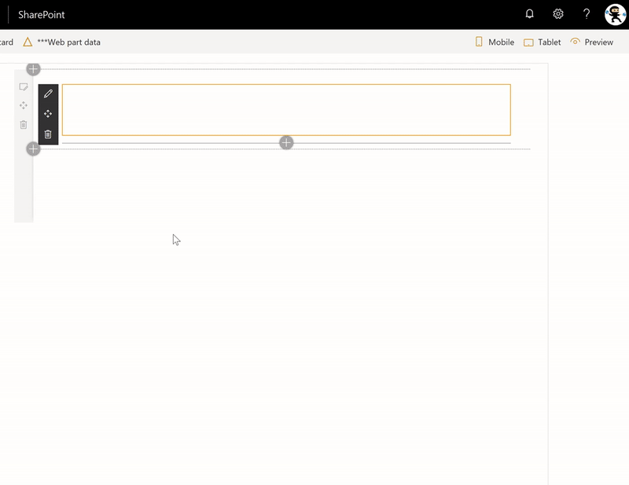

# RichText control

This control provides rich text editing and display capability.



## How to use this control in your solutions

- Check that you installed the `@pnp/spfx-controls-react` dependency. Check out the [getting started](../#getting-started) page for more information about installing the dependency.
- Import the following modules to your component:

```TypeScript
import { RichText } from "@pnp/spfx-controls-react/lib/RichText";
```

- The simplest way to use the `RichText` control in your code is as follows:

```TypeScript
<RichText value={this.props.value}
          onChange={(text)=>this.props.onChange(text)}
/>
```

- The `value` property should contain the HTML that you wish to display
- The `onChange` handler will be called every time a user changes the text. For example, to have your web part store the rich text as it is updated, you would use the following code: 

```TypeScript
private onTextChange = (newText: string) => {
  this.properties.myRichText = newText;
  return newText;
}
```

It is possible to use the `onChange` handler as users type -- for example, the following code replaces all instance of the word `bold` with bold text.

```TypeScript
private onTextChange = (newText: string) => {
  newText = newText.replace(" bold ", " <strong>bold</strong> ");
  this.properties.description = newText;
  return newText;
}
```

## Implementation

The RichText control can be configured with the following properties:

| Property | Type | Required | Description |
| ---- | ---- | ---- | ---- |
| className | string | no | The custom CSS class to apply to the RichText control. |
| isEditMode | boolean | no | `true` indicates that users will be able to edit the content of the RichText control. `false` will display the rich text as read-only. |
| styleOptions | StyleOptions | no | Define the styles you want to show or hide for the rich text editor |
| value | string | no | Sets the rich text to display in the RichText control. |
| onChange | (text: string) => string | no | onChange handler for the RichText control. The function must return a `string` containing the rich text to display in the RichText control. |

`StyleOptions` interface

| Property | Type | Required | Description |
| ---- | ---- | ---- | ---- |
| showAlign | boolean | no | Indicates whether to show the **Align** toolbar button or not. Default value is `true` |
| showBold | boolean | no | Indicates whether to show the **Bold** toolbar button or not. Default value is `true` |
| showItalic | boolean | no | Indicates whether to show the **Italic** toolbar button or not.  Default value is `true` |
| showLink | boolean | no | Indicates whether to show the **Hyperlink** toolbar button or not.  Default value is `true` |
| showList | boolean | no | Indicates whether to show the **List** toolbar button or not.  Default value is `true` |
| showMore | boolean | no | Indicates whether to show the **More** toolbar button or not. Note that this option is indenpendent from the other `show___` options. I.e.: Setting `showBold` to `false` will disable the **Bold** toolbar, but will not disable it from the formatting pane. Default value is `true` |
| showStyles | boolean | no | Indicates whether to show the **Headings** toolbar button or not. Note that this option is indenpendent from the other `show___` options. I.e.: Setting `showBold` to `false` will disable the **Bold** toolbar, but will not disable it from the formatting pane. Default value is `true` |
| showUnderline | boolean | no | Indicates whether to show the **Underline** toolbar button or not. Note that this option is indenpendent from the other `show___` options. I.e.: Setting `showBold` to `false` will disable the **Bold** toolbar, but will not disable it from the formatting pane. Default value is `true` |

> Note that setting `showAlign`, `showBold`, `showItalic`, `showLink`, `showList`, `showStyles`, or
`showUnderline` to `false` does *not* remove the user's ability to apply the button's associated formatting -- it only hides the toolbar option. Also, if `showMore` is `true`, all options remain available in the formatting pane -- regardless whether they were turned off using `show___`. To prevent users from applying specific formats, use the `onChange` handler to parse the rich text and remove the formatting as desired.


