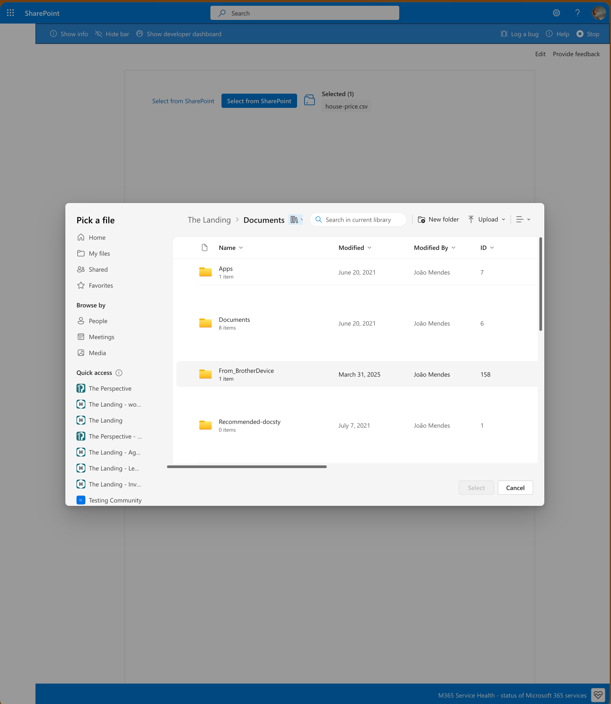

# SPFilePicker

## Overview

The SPFilePicker Control embeds the Microsoft‑hosted **File Picker v8** (`/_layouts/15/FilePicker.aspx`) inside any SharePoint Framework (SPFx) web part or extension. It renders a trigger button that opens the picker in a modal dialog (iframe) or a popup window and returns the selected item(s) through an `onPicked` callback.



It has **no dependency on any adapter** — it works directly from the SPFx `WebPartContext`, resolving the site URL and SharePoint access tokens via the built‑in `aadTokenProviderFactory`.

## Installation

- Check that you installed the `@pnp/spfx-controls-react` dependency. Check out the [getting started](../../#getting-started) page for more information about installing the dependency.
- The picker embedded in an **iframe** must authenticate with SharePoint tokens. Declare these delegated permissions in `config/package-solution.json`:

```jsonc
"solution": {
  // ...
  "webApiPermissionRequests": [
    { "resource": "Office 365 SharePoint Online", "scope": "AllSites.Read" },
    { "resource": "Office 365 SharePoint Online", "scope": "MyFiles.Read" }
  ]
}
```

- After deploying the `.sppkg`, an admin must **approve** these requests in **SharePoint Admin Center → Advanced → API access**. For upload / folder creation, also request `AllSites.Write` / `MyFiles.Write`.

## Importing the SPFilePicker Control

To use the SPFilePicker Control in your React project, import it as follows:

```typescript
import { SPFilePicker } from '@pnp/spfx-controls-react/lib/controls/SPFilePicker';
import { ISPFilePickerItem } from '@pnp/spfx-controls-react/lib/controls/SPFilePicker';
```

## SPFilePicker Props

The SPFilePicker Control accepts the following props:

### Required

| Property  | Type                                   | Required | Description                                                                                                       |
| --------- | -------------------------------------- | -------- | ----------------------------------------------------------------------------------------------------------------- |
| context   | WebPartContext                         | Yes      | The SPFx web part context. Provides the default `baseUrl` and acquires SharePoint tokens via `aadTokenProviderFactory`. |
| onPicked  | (items: ISPFilePickerItem[]) => void   | Yes      | Fired with the selected item(s) when the user confirms.                                                           |

### Picker Behaviour

| Property      | Type                                     | Required | Description                                                                            |
| ------------- | ---------------------------------------- | -------- | -------------------------------------------------------------------------------------- |
| baseUrl       | string                                   | No       | SharePoint web URL used as the picker host and token resource. Defaults to `context.pageContext.web.absoluteUrl`. |
| entry         | ISPFilePickerEntry                       | No       | Where the picker starts: `{ sharePoint: {} }`, `{ oneDrive: {} }`, or `{ site: {} }` (pick only one). Defaults to `{ sharePoint: {} }`. |
| selectionMode | 'single' \| 'multiple' \| 'pick'         | No       | How many items can be selected. Defaults to `single`.                                  |
| itemsMode     | 'files' \| 'folders' \| 'all'            | No       | Kind of items that can be picked. Defaults to `files`.                                 |
| fileTypes     | string[]                                 | No       | Allowed extensions without the dot, e.g. `['docx', 'pdf']`.                            |
| locale        | string                                   | No       | Locale / LCID for the picker UI. Defaults to `en-us`.                                  |
| authMode      | 'token' \| 'cookie'                      | No       | How the picker authenticates. Defaults to `token` (required for the iframe target).    |
| target        | 'iframe' \| 'window'                     | No       | Render inside a modal dialog (`iframe`) or a popup (`window`). Defaults to `iframe`.   |
| app           | string                                   | No       | Optional hosting app identifier (query string `app`).                                  |
| scenario      | string                                   | No       | Optional picker scenario (query string `scenario`).                                    |
| getToken      | (resource: string) => Promise\<string\> | No       | Custom token resolver override. When omitted, uses `aadTokenProviderFactory`.          |

### Callbacks

| Property | Type                                   | Required | Description                                     |
| -------- | -------------------------------------- | -------- | ----------------------------------------------- |
| onPicked | (items: ISPFilePickerItem[]) => void   | Yes      | User confirmed a selection.                     |
| onCancel | () => void                             | No       | User closed the picker without selecting.       |
| onError  | (error: ISPFilePickerError) => void    | No       | An error occurred during the workflow.          |

### Appearance

| Property     | Type      | Required | Description                                                                     |
| ------------ | --------- | -------- | ------------------------------------------------------------------------------- |
| trigger      | ReactNode | No       | Custom trigger element that replaces the default button (receives `onClick`).   |
| buttonText   | string    | No       | Default button label. Defaults to `Select from SharePoint`.                     |
| dialogTitle  | string    | No       | iframe dialog title. Defaults to `Select a file`.                               |
| cancelText   | string    | No       | Cancel button text in the dialog. Defaults to `Cancel`.                         |
| disabled     | boolean   | No       | Disable the trigger. Defaults to `false`.                                       |
| dialogWidth  | number    | No       | Dialog width in px (iframe target). Defaults to `1080`.                         |
| dialogHeight | number    | No       | Dialog / iframe height in px (iframe target). Defaults to `680`.               |
| className    | string    | No       | Additional CSS class applied to the trigger container.                          |

## Picked Item Object (ISPFilePickerItem)

Items returned by the picker are represented using the `ISPFilePickerItem` interface. Only the guaranteed fields are typed; the picker returns many more properties depending on the item.

| Property                  | Type                        | Required | Description                                       |
| ------------------------- | --------------------------- | -------- | ------------------------------------------------- |
| id                        | string                      | Yes      | Unique identifier for the item.                   |
| name                      | string                      | No       | Display name of the item.                         |
| webUrl                    | string                      | No       | Web URL of the item.                              |
| size                      | number                      | No       | Size of the item in bytes.                        |
| parentReference           | { driveId?: string }        | No       | Reference to the parent drive of the item.        |
| '@sharePoint.endpoint'    | string                      | No       | SharePoint endpoint used to build the item URL.   |

A drive-item endpoint can be composed as:

```ts
const url =
  `${item['@sharePoint.endpoint']}/drives/${item.parentReference?.driveId}/items/${item.id}`;
```

## Authentication Modes

| Mode              | When to use                                                                                                  | Requirements                                                              |
| ----------------- | ------------------------------------------------------------------------------------------------------------ | ------------------------------------------------------------------------ |
| token (default)   | **iframe** target — required for SPFx web parts. The host answers the picker's `authenticate` command with a SharePoint token. | The `AllSites.Read` / `MyFiles.Read` permissions must be **approved** in the tenant. |
| cookie            | **popup window** target only (`target="window"`). Uses the user's existing SharePoint session; no API permission needed. | Not supported for iframe embedding — the picker would render but never return a selection. |

> ⚠️ For the default in‑dialog (iframe) experience, keep `authMode="token"`. `cookie` mode omits the picker `authentication` config, which the picker requires when framed.

## Usage Example

Here’s an example of how to integrate the SPFilePicker Control in a React component. Wrap the control in a Fluent UI v9 `FluentProvider` and pass the SPFx `context` — that is the **only** required prop besides `onPicked`:

```typescript
import * as React from 'react';
import { FluentProvider, webLightTheme } from '@fluentui/react-components';
import { SPFilePicker, ISPFilePickerItem } from '@pnp/spfx-controls-react/lib/controls/SPFilePicker';
import type { WebPartContext } from '@microsoft/sp-webpart-base';

export const MyComponent: React.FC<{ context: WebPartContext }> = ({ context }) => {
  const [files, setFiles] = React.useState<ISPFilePickerItem[]>([]);

  return (
    <FluentProvider theme={webLightTheme}>
      <SPFilePicker
        context={context}
        selectionMode="multiple"
        fileTypes={['docx', 'pdf']}
        onPicked={setFiles}
        onCancel={() => console.log('Picker cancelled')}
        onError={(error) => console.error(error)}
      />

      <ul>
        {files.map((f) => (
          <li key={f.id}>{f.name}</li>
        ))}
      </ul>
    </FluentProvider>
  );
};
```

In the web part, pass `this.context`:

```ts
const element = React.createElement(MyComponent, { context: this.context });
ReactDom.render(element, this.domElement);
```

## Advanced: the `useSPFilePicker` hook

For a fully custom surface, use the engine hook directly. It handles the `postMessage` handshake, token flow, and command responses; you render the iframe yourself.

```typescript
import { useSPFilePicker } from '@pnp/spfx-controls-react/lib/controls/SPFilePicker';

const { isOpen, isLoading, iframeRef, open, close, markLoaded } = useSPFilePicker({
  context,
  baseUrl: context.pageContext.web.absoluteUrl,
  selectionMode: 'multiple',
  fileTypes: ['docx', 'pdf'],
  onPicked: (items) => console.info(items),
});

return (
  <>
    <button onClick={open}>Pick files</button>
    {isOpen && <iframe ref={iframeRef} onLoad={markLoaded} />}
  </>
);
```

### Hook return

| Field      | Type                                | Description                                                        |
| ---------- | ----------------------------------- | ------------------------------------------------------------------ |
| isOpen     | boolean                             | Whether the picker surface is open.                                |
| isLoading  | boolean                             | Whether the picker is launching / loading.                        |
| error      | ISPFilePickerError \| undefined     | The last error.                                                    |
| iframeRef  | RefObject\<HTMLIFrameElement\>      | Attach to your `<iframe>` (iframe target).                        |
| open       | () => void                          | Open the picker.                                                   |
| close      | () => void                          | Close it and tear down messaging.                                  |
| markLoaded | () => void                          | Clear the loading overlay (attach to `<iframe onLoad>`).          |

## Troubleshooting

| Symptom                                        | Cause / fix                                                                                              |
| ---------------------------------------------- | ------------------------------------------------------------------------------------------------------- |
| Picker opens but **Select / Cancel do nothing** | Running in `cookie` mode inside an iframe. Use `authMode="token"` (the default).                        |
| Picker **times out**                            | The `authentication` config was sent in cookie mode, or tokens aren't returned. Use token mode and ensure permissions are approved. |
| `getToken` fails / 403                          | The `AllSites.Read` / `MyFiles.Read` permissions are not **approved** in SharePoint Admin Center → API access. |
| Nothing renders                                 | Ensure the control is wrapped in a Fluent UI v9 `FluentProvider`.                                       |

## References

- [File Picker v8 overview](https://learn.microsoft.com/onedrive/developer/controls/file-pickers/)
- [File Picker v8 configuration schema](https://learn.microsoft.com/onedrive/developer/controls/file-pickers/v8-schema)
- [Connect to Entra ID‑secured APIs in SPFx](https://learn.microsoft.com/sharepoint/dev/spfx/use-aadhttpclient)

## Conclusion

The SPFilePicker Control provides a simple, adapter‑free way to embed the Microsoft File Picker v8 in SPFx solutions. It supports single and multiple selection, file and folder picking, custom triggers, and both iframe and popup surfaces to enhance the file selection experience.


