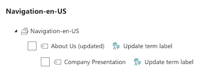

# Taxonomy Picker

This control allows you to select one or more Terms from a TermSet via its name or TermSet ID. You can also configure the control to select the child terms from a specific term in the TermSet by setting the AnchorId.

!!! note "Disclaimer"
    This control makes use of the `ProcessQuery` API end-points to retrieve the managed metadata information. This will get changed once the APIs for managing managed metadata will become available.

- Empty term picker:


- Selecting terms:


- Selected terms in picker:


- Term picker: Auto Complete:


## How to use this control in your solutions

- Check that you installed the `@pnp/spfx-controls-react` dependency. Check out the [getting started](../../#getting-started) page for more information about installing the dependency.
- Import the following modules to your component:

```TypeScript
import { TaxonomyPicker, IPickerTerms } from "@pnp/spfx-controls-react/lib/TaxonomyPicker";
```

- Use the `TaxonomyPicker` control in your code as follows:

```TypeScript
<TaxonomyPicker allowMultipleSelections={true}
                termsetNameOrID="Countries"
                panelTitle="Select Term"
                label="Taxonomy Picker"
                context={this.props.context}
                onChange={this.onTaxPickerChange}
                isTermSetSelectable={false} />
```

- With the `onChange` property you can capture the event of when the terms in the picker has changed:

```typescript
private onTaxPickerChange(terms : IPickerTerms) {
  console.log("Terms", terms);
}
```

- With the `onNewTerm` property you can capture the event, when text is in the input field and
enter/return is pressed. With a controlled TaxonomyPicker, this enables you to create the term 
and have the same flow as in SharePoint Keywords fields.

```typescript
    const onNewTerm = (value: IPickerTerm): void => {
            if(value?.name && EmptyGuid === value.key ){
                console.log(`TaxonmyPicker.onNewTerm name=${value.name}`, value );
                // Create keyword
            } else {
                console.error(`TaxonmyPicker.onNewTerm name=${value?.name}`, value );
            }
        };
```

## Term actions

Since version `1.12.0`, you can apply term actions to all terms or specific ones. Term actions could for instance be used to retrieve the labels of the term, or retrieve other information. These term actions can be implemented as follows:

```typescript
<TaxonomyPicker allowMultipleSelections={true}
                termsetNameOrID="Countries"
                panelTitle="Select Term"
                label="Taxonomy Picker"
                context={this.props.context}
                onChange={this.onServicePickerChange}
                isTermSetSelectable={false}
                termActions={{
                  actions: [{
                    title: "Get term labels",
                    iconName: "LocaleLanguage",
                    id: "test",
                    invokeActionOnRender: true,
                    hidden: true,
                    actionCallback: async (taxService: SPTermStorePickerService, term: ITerm) => {
                      console.log(term.Name, term.TermsCount);
                      return {
                        updateActionType: UpdateType.updateTermLabel,
                        value: `${term.Name} (updated)`
                      };
                    },
                    applyToTerm: (term: ITerm, triggerActionCb: (updateAction: UpdateAction) => void, setActionStateForTerm: (actionId: string, termId: string, type: "disabled" | "hidden", value: boolean) => void) => (term && term.Name && term.Name === "internal")
                  },
                  {
                    title: "Hide term",
                    id: "hideTerm",
                    invokeActionOnRender: true,
                    hidden: true,
                    actionCallback: async (taxService: SPTermStorePickerService, term: ITerm) => {
                      return {
                        updateActionType: UpdateType.hideTerm,
                        value: true
                      };
                    },
                    applyToTerm: (term: ITerm, triggerActionCb: (updateAction: UpdateAction) => void, setActionStateForTerm: (actionId: string, termId: string, type: "disabled" | "hidden", value: boolean) => void) => (term && term.Name && (term.Name.toLowerCase() === "help desk" || term.Name.toLowerCase() === "multi-column valo site page"))
                  },
                  {
                    title: "Disable term",
                    id: "disableTerm",
                    invokeActionOnRender: true,
                    hidden: true,
                    actionCallback: async (taxService: SPTermStorePickerService, term: ITerm) => {
                      return {
                        updateActionType: UpdateType.disableTerm,
                        value: true
                      };
                    },
                    applyToTerm: (term: ITerm, triggerActionCb: (updateAction: UpdateAction) => void, setActionStateForTerm: (actionId: string, termId: string, type: "disabled" | "hidden", value: boolean) => void) => (term && term.Name && term.Name.toLowerCase() === "secured")
                  },
                  {
                    title: "Disable or hide term",
                    id: "disableOrHideTerm",
                    invokeActionOnRender: true,
                    hidden: true,
                    actionCallback: async (taxService: SPTermStorePickerService, term: ITerm) => {
                      if (term.TermsCount > 0) {
                        return {
                          updateActionType: UpdateType.disableTerm,
                          value: true
                        };
                      }
                      return {
                        updateActionType: UpdateType.hideTerm,
                        value: true
                      };
                    },
                    applyToTerm: (term: ITerm, triggerActionCb: (updateAction: UpdateAction) => void, setActionStateForTerm: (actionId: string, termId: string, type: "disabled" | "hidden", value: boolean) => void) => true
                  }]
                }} />
```



We also provided a default term action which you can use to retrieve the term its labels and will update the term text in the TaxonomyPicker hierarchy.

```typescript
<TaxonomyPicker allowMultipleSelections={true}
                termsetNameOrID="Countries"
                panelTitle="Select Term"
                label="Taxonomy Picker"
                context={this.props.context}
                onChange={this.onServicePickerChange}
                isTermSetSelectable={false}
                termActions={{
                  actions: [new TermLabelAction("Get Labels")]
                }} />
```

## Implementation

The TaxonomyPicker control can be configured with the following properties:

| Property | Type | Required | Description |
| ---- | ---- | ---- | ---- |
| panelTitle | string | yes | TermSet Picker Panel title. |
| label | string | yes | Text displayed above the Taxonomy Picker. |
| disabled | boolean | no | Specify if the control needs to be disabled. |
| context | BaseComponentContext | yes | Context of the current web part or extension. |
| initialValues | IPickerTerms | no | Defines the terms selected by default. For each term object selected by default, an empty string can be provided for the `path` and `termset` properties as these properties are ignored when setting initial values. |
| allowMultipleSelections | boolean | no | Defines if the user can select only one or many term sets. Default value is false. |
| termsetNameOrID | string | yes | The name or Id of your TermSet that you would like the Taxonomy Picker to chose terms from. |
| onChange | function | no |  captures the event of when the terms in the picker has changed. |
| onNewTerm | function | no | captures the event when text is in the input field and the user presses return |
| isTermSetSelectable | boolean | no | Specify if the TermSet itself is selectable in the tree view. |
| disabledTermIds | string[] | no | Specify which terms should be disabled in the term set so that they cannot be selected. |
| disableChildrenOfDisabledParents | boolean | no | Specify if you want to disable the child terms when their parent is disabled. |
| anchorId | string | no | Set the anchor id to a child term in the TermSet to be able to select terms from that level and below. |
| termActions | ITermActions | no | Allows to execute custom action on the term like e.g. get other term labelsITermActions. |
| hideTagsNotAvailableForTagging | boolean | no | Specifies if the tags marked with 'Available for tagging' = false should be hidden |
| validateOnLoad | boolean | no | Specifies if the initial values will be validated, when the component is loaded. Default value is false |
| validateInput | boolean | no | Specifies if the input text will be validated, when the component focus is changed |
| hideDeprecatedTags | boolean | no | Specifies if deprecated tags  should be hidden |
| placeholder | string | no | Short text hint to display in empty picker |
| errorMessage | string | no | Static error message displayed below the picker. Use `onGetErrorMessage` to dynamically change the error message displayed (if any) based on the current value. `errorMessage` and `onGetErrorMessage` are mutually exclusive (`errorMessage` takes precedence). |
| onGetErrorMessage | (value: IPickerTerms) => string \| Promise&lt;string&gt; | no | The method is used to get the validation error message and determine whether the picker value is valid or not. Mutually exclusive with the static string `errorMessage` (it will take precedence over this).<br />When it returns string:<ul><li>If valid, it returns empty string.</li><li>If invalid, it returns the error message string to be shown below the picker.</li></ul><br />When it returns Promise&lt;string&gt;:<ul><li>The resolved value is display as error message.</li><li>The rejected, the value is thrown away.</li></ul> |
| required | boolean | no | Specifies if to display an asterisk near the label. Note that error message should be specified in `onGetErrorMessage` or `errorMessage` |
| useSessionStorage | boolean | no | Specify if the control uses session storage. Default is set to true for better performance. |
| onPanelSelectionChange | (prevValue: IPickerTerms, newValue: IPickerTerms) => void | no | Panel selection change handler. Can be used to interact with the control while selecting items in the panel, before Click or Cancel is clicked. |
| selectChildrenIfParentSelected | boolean | no | Specifies if the children should be selected when parent item is selected (defaults to false). |

Interface `IPickerTerm`

| Property | Type | Required | Description |
| ---- | ---- | ---- | ---- |
| key | string | yes | The ID of the term |
| name | string | yes | The name of the term |
| path | string | yes | The path of the term |
| termSet | string | yes | The Id of the parent TermSet of the term |
| termSetName | string | no | The Name of the parent TermSet of the term |

Interface `IPickerTerms`

An Array of IPickerTerm

Interface `ITermActions`

| Property | Type | Required | Description | Default |
| ---- | ---- | ---- | ---- | ---- |
| actions | ITermAction[] | yes | The array of supported actions | |
| termActionsDisplayStyle | TermActionsDisplayStyle | no | Defines how to display term action button, available options: text, icon, text and icon | text |
| termActionsDisplayMode | TermActionsDisplayMode | no | Defines how to display term actions, as buttons or dropdown | buttons |
| initialize | (spTermService: SPTermStorePickerService) => Promise&lt;void&gt; | no | Initializes the term action with the taxonomy service | |

Interface `ITreeItemAction`

| Property | Type | Required | Description |
| ---- | ---- | ---- | ---- |
| id | string | yes | Unique id of the term action |
| title | string | yes | Action title |
| iconName | string | no | Name of the icon to be used to display action |
| hidden | boolean | no | Specify if the action is hidden. This could be used for instance when you want to invoke the action right after rendering. |
| invokeActionOnRender | boolean | no | Specifies if you want to invoke the action on render |
| applyToTerm | (currentTerm: ITerm, triggerActionCallback: (updateAction: UpdateAction) => void, setActionStateForTerm: (actionId: string, termId: string, type: `disabled` \| `hidden`, value: boolean) => void) => Promise&lt;boolean&gt; \| boolean | yes | Method checks if the current term is supported for the action. The method provides a couple of additional callback functions to make it possible to programmatically change the terms and its actions. |
| actionCallback | (spTermService: SPTermStorePickerService, currentTerm: ITerm) => Promise&lt;UpdateAction&gt; | yes | Method to be executed when action is fired |

Interface `UpdateAction`

| Property | Type | Required | Description |
| ---- | ---- | ---- | ---- |
| updateActionType | UpdateType | yes | Defines the type of update you want to perform |
| value | string \| boolean | no | When `updateTermLabel` is used, it should return a string. When `hideTerm` or `disableTerm` are used, you should return a boolean. |

Enum `UpdateType`

| Value           |
| --------------- |
| updateTermLabel |
| updateTermsTree |
| hideTerm        |
| disableTerm     |
| selectTerm      |


