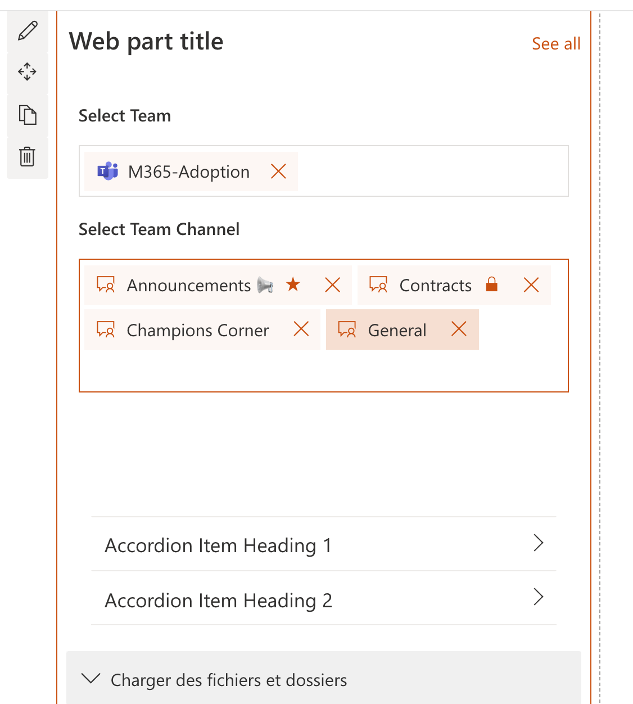

# TeamChannelPicker control

This control allows you to select one or multiple Team Channels based on user's permissions.

!!! Note
    You can also check out [Microsoft Teams Channel Picker](https://docs.microsoft.com/graph/toolkit/components/teams-channel-picker) component in the [Microsoft Graph Toolkit](https://github.com/microsoftgraph/microsoft-graph-toolkit).

Here is an example of the control:


`SelectTeamChannelPicker` single selection mode:



## How to use this control in your solutions

- Check that you installed the `@pnp/spfx-controls-react` dependency. Check out the [getting started](../../#getting-started) page for more information about installing the dependency.
- Import the control into your component:

```TypeScript
import { TeamChannelPicker } from "@pnp/spfx-controls-react/lib/TeamChannelPicker";
```

- Use the `TeamChannelPicker` control in your code as follows:

```TypeScript
<TeamChannelPicker  label="Select Team channel"
                    teamId={teamId}
                    selectedChannels={selectedTeamChannels}
                    appcontext={webpartContext}
                    itemLimit={1}
                    onSelectedChannels={_onSelectedTeamChannels}/>
```

- The `_onSelectedTeamChannels` change event returns the team channel(s) and can be implemented as follows:

```TypeScript
const _onSelectedTeamChannels ((tagList: ITag[]) => {
    console.log(tagList);
}
```

## Implementation

The `SelectTeamChannelPicker` control can be configured with the following properties:

| Property            | Type                               | Required | Description                                                  |
| ------------------- | ---------------------------------- | -------- | ------------------------------------------------------------ |
| teamId              | string                             | yes      | Id of Team to get channels                                   |
| appcontext          | WebPartContext \| ExtensionContext | yes      | The context object of the SPFx loaded webpart or customizer. |
| selectedChannels    | ITag[]                             | yes      | Array with selected channels                                 |
| itemLimit           | number                             | no       | number of allowed selected channels                          |
| label               | string                             | no       | Label of Picker                                              |
| styles              | IBasePickerStyles                  | no       | Customer Styles of Picker                                    |
| onSelectedChannels: | (tagsList:ITag[]) => void;         | yes      | callBack with channels Selected                              |

## MSGraph Permissions required

This control requires at least the following scopes:

- `Channel.ReadBasic.All`
- `Team.ReadBasic.All`
