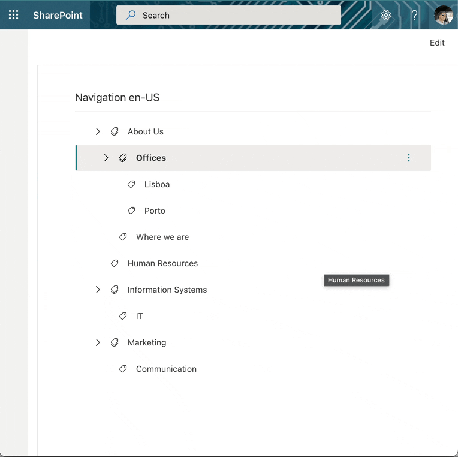

# TermSetNavigation

This control allows you to navigate and select a Term from a TermSet. You can also configure a context menu for a term to execute a specific action.




## How to use this control in your solutions

- Check that you installed the `@pnp/spfx-controls-react` dependency. Check out the [getting started](../../#getting-started) page for more information about installing the dependency.
- Import the following modules to your component:

```TypeScript
import { TermSetNavigation } from '@pnp/spfx-controls-react/lib/TermSetNavigation';
```

- Use the `TermSetNavigation` control in your code as follows:

```TypeScript
<TermSetNavigation
          context={context}
          themeVariant={themeVariant}
          termSetId={"289180a0-4a8b-4f08-ae6e-ea3fb1b669e2"}
          showContextMenu={true}
          contextMenuItems={[
            {
              key: "add",
              text: "Add",
              iconProps: { iconName: "add" },
            },
            {
              key: "adit",
              text: "Edit",
              iconProps: { iconName: "Edit" },
            },
            {
              key: "remove",
              text: "Remove",
              iconProps: { iconName: "delete" },
            },
          ]}
          onSelected={onSelect}
          onSelectedTermAction={onSelectedTermAction}
        />
```

- With the `onSelected` property you can get the selected term:

```typescript
const onSelect = React.useCallback((selected: TermStore.Term) => {
  console.log(selected);
}, []);
```

- With the `onSelectedTermAction` property you can get the the action on the contextMenu for the selected term:

```typescript
const onSelectedTermAction = React.useCallback((selected: TermStore.Term, option:string) => {
  console.log(selected, option);
}, []);
```

## Implementation

The TermSetNavigation control can be configured with the following properties:

| Property | Type | Required | Description |
| ---- | ---- | ---- | ---- |
| themeVariant | IReadonlyTheme | yes | ThemeVariant |
| termSetId | string | yes | Term Set Id |
| context | BaseComponentContext | yes | Context of the current web part or extension. |
| showContextMenu | boolean | no | If `true`, shows ContextMenu for term |
| contextMenuItems |IContextualMenuItem[] | no | Array of action to show on contextMenu, if is undefined the contextMenu won't be available |
| onSelected |onSelected?: (term: TermStore.Term) => void| no | Returns Term Selected |
| onSelectedTermAction | onSelectedTermAction?: (term : TermStore.Term, option:string) => void | no | return  the action selected to to term |

## MSGraph Permissions required

This control requires at least one of the following scopes:

- `TermStore.Read.All`
- `TermStore.ReadWrite.All`


