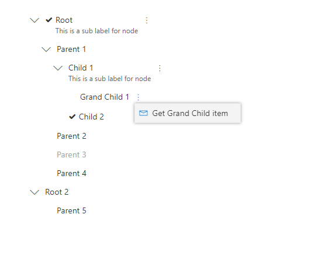
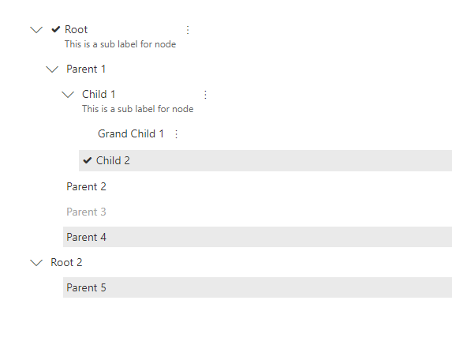

# TreeView control

This graphical control allows to present a hierarchical view of information. Each tree item can have a number of subitems. This is often visualized by indentation in a list. A tree item can be expanded to reveal subitems (if exist), and collapsed to hide subitems.

Here are examples of the control in action:


- With all possible options:


- Without check boxes or when selection mode is 'None':



- Without check boxes, and selection mode is multiple:



## How to use this control in your solutions

- Check that you installed the `@pnp/spfx-controls-react` dependency. Check out the [getting started](../../#getting-started) page for more information about installing the dependency.
- Import the following modules to your component:

```TypeScript
import { TreeView, ITreeItem, TreeViewSelectionMode } from "@pnp/spfx-controls-react/lib/TreeView";
```

- Use the `TreeView` control in your code as follows:

```TypeScript
<TreeView 
    items={treeitems}
    defaultExpanded={false}
    selectionMode={TreeViewSelectionMode.Multiple}
    selectChildrenMode={SelectChildrenMode.Select | SelectChildrenMode.Unselect}
    showCheckboxes={true}
    treeItemActionsDisplayMode={TreeItemActionsDisplayMode.ContextualMenu}
    defaultSelectedKeys={['key1', 'key2']}
    expandToSelected={true}
    defaultExpandedChildren={true}
    onSelect={this.onTreeItemSelect}
    onExpandCollapse={this.onTreeItemExpandCollapse}
    onRenderItem={this.renderCustomTreeItem}
    theme={this.props.themeVariant} />
```

- With the `onSelect` property you can capture the event of when the tree item in the TreeView has changed the selection:

```typescript
private onTreeItemSelect(items: ITreeItem[]) {
    console.log("Items selected: ", items);
}
```

- With the `onExpandCollapse` property you can capture the event of when the tree item in the TreeView has expanded or collapsed:

```typescript
private onTreeItemExpandCollapse(item: ITreeItem, isExpanded: boolean) {
    console.log((isExpanded ? "Item expanded: " : "Item collapsed: ") + item);  
}
```

## Custom Rendering

You can fully customize how tree items are rendered by providing the `onRenderItem` callback function and returning whatever `JSX.Element` you want.

For example, you can define your function in a .tsx file like this:

```typescript
import * as React from 'react';

private renderCustomTreeItem(item: ITreeItem): JSX.Element {
  return (
    <span>
      {
        item.iconProps &&
        <i className={"ms-Icon ms-Icon--" + item.iconProps.iconName} style={{ paddingRight: '4px' }} />
      }
      {item.label}
    </span>
  );
}
```

## Implementation

The `TreeView` control can be configured with the following properties:

| Property                       | Type                       | Required | Description                                                                                                                        |
|--------------------------------|----------------------------|----------|------------------------------------------------------------------------------------------------------------------------------------|
| items                          | ITreeItem[]                | yes      | An array of tree items to display. refer [example](#example-of-array-of-tree-items-used-to-render-control-as-in-2nd-screenshot). |
| defaultExpanded                | boolean                    | no       | Specify if the tree items are displayed as expanded by default (defaults to false).                                                |
| selectionMode                  | enum                       | no       | Specifies the selection mode of tree view (defaults to Single selection).                                                            |
| selectChildrenIfParentSelected | boolean                    | no       | Specifies if the children should be selected when parent item is selected (defaults to false). __Deprecated__: prefer usage of `selectChildrenMode` for more flexibility.                                      |
| selectChildrenMode | SelectChildrenMode                    | no       | Specifies if the children should be selected when parent item is selected (defaults to None). Flagged enum, values can be combined eg. `SelectChildrenMode.Select \| SelectChildrenMode.Unselect`                                     |
| showCheckboxes                 | boolean                    | yes      | Specify if the checkboxes should be displayed for selection.                                                                       |
| treeItemActionsDisplayMode     | TreeItemActionsDisplayMode | no       | Specifies the display mode of the tree item actions.                                                                                 |
| defaultSelectedKeys            | string[]                   | no       | Specifies keys of items to be selected by default.                                                                                   |
| expandToSelected               | boolean                    | no       | Specifies if the tree view is expanded to display selected nodes.                                                                                   |
| onExpandCollapse               | function                   | no       | Defines a onExpandCollapse function to raise when the tree item has expanded or collapsed.                                         |
| onSelect                       | function                   | no       | Captures the event of when the tree item selection has changed.                                                                    |
| onRenderItem                   | function                   | no       | Optional callback to provide custom rendering of the item (default is simple text of item label and a checkbox for selection).     |
| defaultExpandedChildren        | boolean                    | no       | Default expand / collapse behavior for the child nodes. By default this is set to true. |
| defaultExpandedKeys | string[] | no      | Keys of items expanded by default. |
| theme | IPartialTheme \| ITheme | no | Set Fluent UI Theme. If not set or set to null or not defined, the theme passed through context will be used, or the default theme of the page will be loaded. |

Enum `TreeViewSelectionMode`

Specifies the selection mode of tree item.

| Value    |
| -------- |
| Single   |
| Multiple |
| None     |

Enum `SelectChildrenMode`

Specifies when the children of a selected item need to be automatically selected.

| Value    | Description                                                      |
|----------|------------------------------------------------------------------|
| None   | Children are never selected                                        |
| Select | When selecting an item, its children are also selected             |
| Unselect     | When unselecting an item, its children are also unselected   |
| Mount     | When the component is mounted, all children of selected items are also selected |
| Update     | When the component receives new props, all children of selected items are also selected |
| All     | Shorthand for a combination of all of the above, same as `SelectChildrenMode.Select` \| `SelectChildrenMode.Unselect` \| `SelectChildrenMode.Mount` \| `SelectChildrenMode.Update` |

Interface `ITreeItem`

Each tree item in the `treeitems` property is defined as `ITreeItem` as follows:

| Property   | Type              | Required | Description                                                      |
|------------|-------------------|----------|------------------------------------------------------------------|
| key        | string            | yes      | The unique ID of the tree item.                                  |
| label      | string            | yes      | Text displayed next to checkbox.                                 |
| subLabel   | string            | no       | The sub label of the tree item.                                  |
| iconProps  | IIconProps        | no       | Custom icon to be rendered before label.                         |
| disabled   | boolean           | no       | Specify if the tree item needs to be disabled. Default is false. |
| selectable | boolean           | no       | Specify if the tree item can be selected. Default is true.       |
| data       | any               | no       | Specify an additional data of the tree item.                     |
| actions    | ITreeItemAction[] | no       | Specify list of actions for the tree item.                       |
| children   | ITreeItem[]       | no       | Specify list of child tree items.                                |

Interface `ITreeItemAction`

Specifies the list of actions for the tree item.

| Property             | Type                                 | Required | Description |
|----------------------|--------------------------------------|----------|----------------------------------------------------------------------------------------------------------------------------|
| id                   | string                               | yes      | Unique id of the action.                                                                                                   |
| title                | string                               | yes      | Title of the action.                                                                                                       |
| iconProps            | IIconProps                           | no       | Name of the icon to be used to display action.                                                                             |
| hidden               | boolean                              | no       | Specify if the action is hidden. This could be used for instance when you want to invoke the action right after rendering. |
| invokeActionOnRender | boolean                              | no       | Specifies if you want to invoke the action on render.                                                                      |
| actionCallback       | (currentTreeItem: ITreeItem) => void | yes      | Method to be executed when action is fired.                                                                                |

Enum `TreeItemActionsDisplayMode`

Specifies the display mode of the tree item action.

| Value          |
|----------------|
| Buttons        |
| ContextualMenu |

## Example of array of tree items used to render control as in 2nd screenshot

```typescript
items: [
          {
            key: "R1",
            label: "Root",
            subLabel: "This is a sub label for node",
            iconProps: skypeCheckIcon,
            actions: [{
              title: "Get item",
              iconProps: {
                iconName: 'Warning',
                style: {
                  color: 'salmon',
                },
              },
              id: "GetItem",
              actionCallback: async (treeItem: ITreeItem) => {
                console.log(treeItem);
              }
            }],
            children: [
              {
                key: "1",
                label: "Parent 1",
                selectable: false,
                children: [
                  {
                    key: "3",
                    label: "Child 1",
                    subLabel: "This is a sub label for node",
                    actions: [{
                      title:"Share",
                      iconProps: {
                        iconName: 'Share'
                      },
                      id: "GetItem",
                      actionCallback: async (treeItem: ITreeItem) => {
                        console.log(treeItem);
                      }
                    }],
                    children: [
                      {
                        key: "gc1",
                        label: "Grand Child 1",
                        actions: [{
                          title: "Get Grand Child item",
                          iconProps: {
                            iconName: 'Mail'
                          },
                          id: "GetItem",
                          actionCallback: async (treeItem: ITreeItem) => {
                            console.log(treeItem);
                          }
                        }]
                      }
                    ]
                  },
                  {
                    key: "4",
                    label: "Child 2",
                    iconProps: skypeCheckIcon
                  }
                ]
              },
              {
                key: "2",
                label: "Parent 2"
              },
              {
                key: "5",
                label: "Parent 3",
                disabled: true
              },
              {
                key: "6",
                label: "Parent 4",
                selectable: true
              }
            ]
          },
          {
            key: "R2",
            label: "Root 2",
            children: [
              {
                key: "8",
                label: "Parent 5"
              }
            ]
          }
        ]
```

`iconProps` in above example can be declared as below

```typescript
private skypeCheckIcon: IIconProps = { iconName: 'SkypeCheck' };
```


