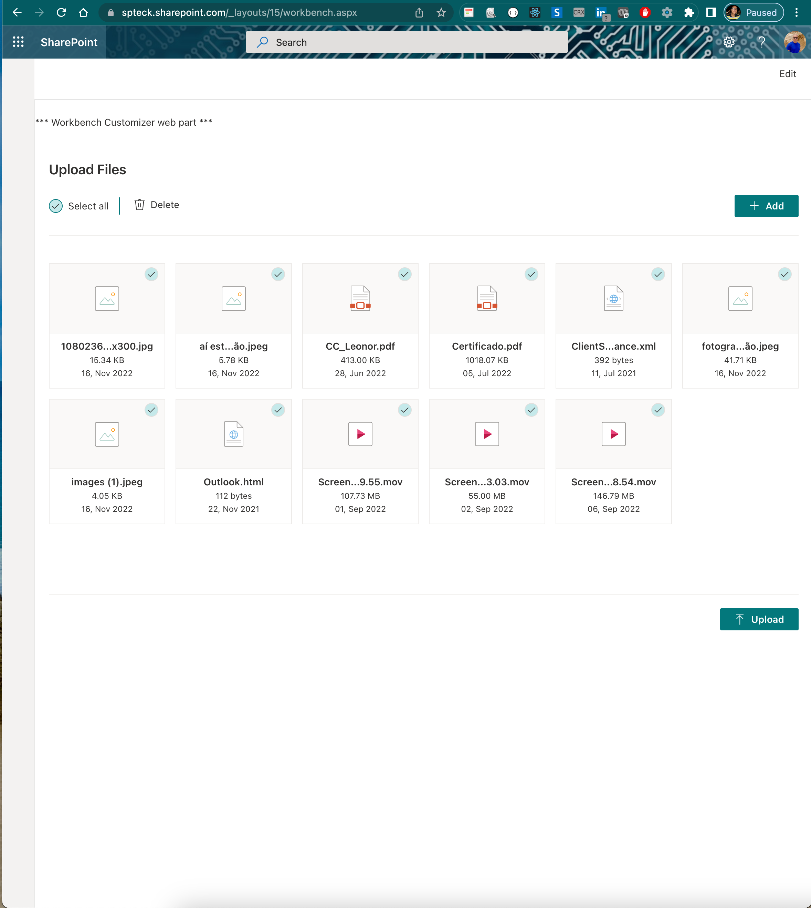

# UploadFiles

This control allows to drag and drop files and manage files before upload.

## How to use this control in your solutions

- Check that you installed the `@pnp/spfx-controls-react` dependency. Check out the [getting started](../../#getting-started) page for more information about installing the dependency.
- Import the following modules to your component:

```TypeScript
import {
  UploadFiles,
} from '@pnp/spfx-controls-react/lib/UploadFiles';
```

- Use the UploadFiles control in your code as follows:

```jsx
 <UploadFiles
          pageSize={20}
          context={context}
          title="Upload Files"
          onUploadFiles={(files) => {
            console.log("files", files);
          }}
          themeVariant={themeVariant}
        />
```




## Implementation

The `UploadFiles` can be configured with the following properties:

| Property      | Type                     | Required | Description                                                                                        |
| ------------- | ------------------------ | -------- | -------------------------------------------------------------------------------------------------- |
| pageSize      | number                   | no       | number of files to show per page base on this value the height of control is calculate, default 15 |
| context       | WebPartContext           | yes      | webPartContext                                                                                     |
| title         | string                   | yes      | title                                                                                              |
| onUploadFiles | (files: File[]) => void; | yes      | Method that returns all Files[]                                                                    |
| themeVariant  | IReadonlyTheme           | no       | Theme Variant                                                                                      |


