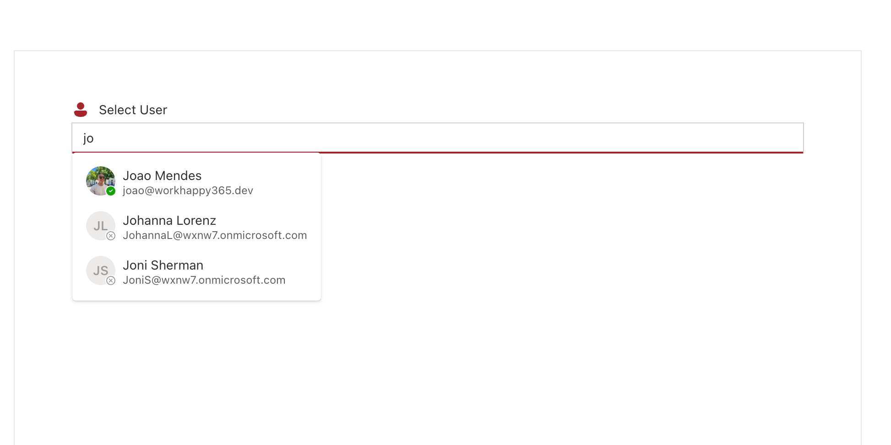
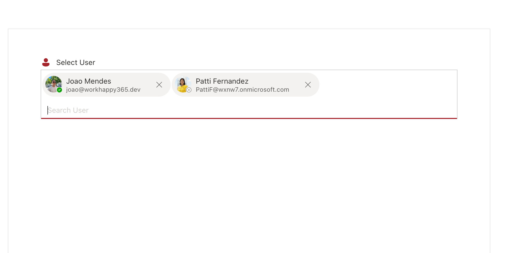

# User Picker

This control allows you to select one or more user from a AAD via its name or starting characters.

- Empty user picker:


- Selecting Users:



- Selected users in picker:



## How to use this control in your solutions

- Check that you installed the `@pnp/spfx-controls-react` dependency. Check out the [getting started](../../#getting-started) page for more information about installing the dependency.
- Import the following modules to your component:

```TypeScript
import { UserPicker } from '@pnp/spfx-controls-react/lib/userPicker';
import { IUserInfo } from '@pnp/spfx-controls-react/lib/userPicker/models/IUserInfo';
```

- Use the `UserPicker` control in your code as follows:

```TypeScript
 <UserPicker
        context={context}
        secondaryTextPropertyName="mail"
        theme={theme}
        label={
          <div className={styles.attributeHader}>
            <Person20Filled color={tokens.colorBrandForeground1} />
            <Body1>Select User</Body1>
          </div>
        }
        placeholder={"Search User"}
        onSelectedUsers={onSelectedUsers}
        onRemoveSelectedUser={onRemovedUser}
/>
```

- With the `onSelectedUsers` property you can capture the event of when the user in the picker has changed:

```typescript
const onSelectedUsers = React.useCallback((users: IUserInfo[]) => {
  console.log(users);
}, []);
```

- With the `onRemoveSelectedUser` property you can capture the event, when the user is removed from picker.

```typescript
const onRemovedUser = React.useCallback((user: IUserInfo) => {
  console.log(user);
}, []);
```

## Implementation

The UserPicker control can be configured with the following properties:

| Property                  | Type                                                                                                                  | Required | Description                                                     |
| ------------------------- | --------------------------------------------------------------------------------------------------------------------- | -------- | --------------------------------------------------------------- |
| userSelectionLimit        | number                                                                                                                | no       | Number selected users allowed                                   |
| label                     | string or JSX.Element                                                                                                 | no       | Text or control displayed above the User Picker.                |
| required                  | boolean                                                                                                               | no       | Specify if the control is required                              |
| context                   | BaseComponentContext                                                                                                  | yes      | Context of the current web part or extension.                   |
| validationMessage         | string                                                                                                                | no       | Defines message to show on picker                               |
| messageType               | "error", "success" , "warning" , "none"                                                                               | no       | Defines message type to show if validationMessage is defined    |
| onSelectedUsers           | (users: IUserInfo[]) => void                                                                                          | no       | captures the event of when the users in the picker has changed. |
| onRemoveSelectedUser      | (user: IUserInfo) => void                                                                                             | no       | captures the event of when the user in the picker was removed   |
| placeholder               | string                                                                                                                | no       | placeholder to show                                             |
| defaultSelectedUsers       | IUserInfo[]                                                                                                           | no       | default users to show on the picker                             |
| theme                     | IReadonlyTheme                                                                                                        | no       | theme                                                           |
| secondaryTextPropertyName | values: "jobTitle" , "department" , "mail", "officeLocation" , "mobilePhone" , "businessPhones" , "userPrincipalName" | no       | secondary text to show on persona card                          |

Interface `IUserInfo` extends `User` interface from `@microsoft/microsoft-graph-types`

| Property  | Type     | Required | Description                       |
| --------- | -------- | -------- | --------------------------------- |
| userPhoto | string   | yes      | User photo to show on Person card |
| presence  | Presence | yes      | User presence                     |


