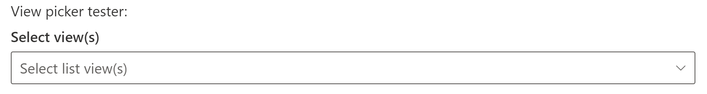
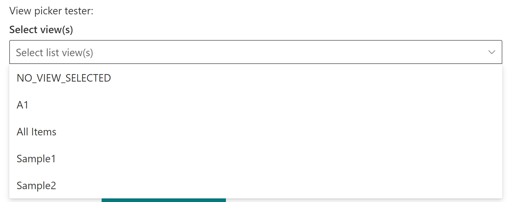
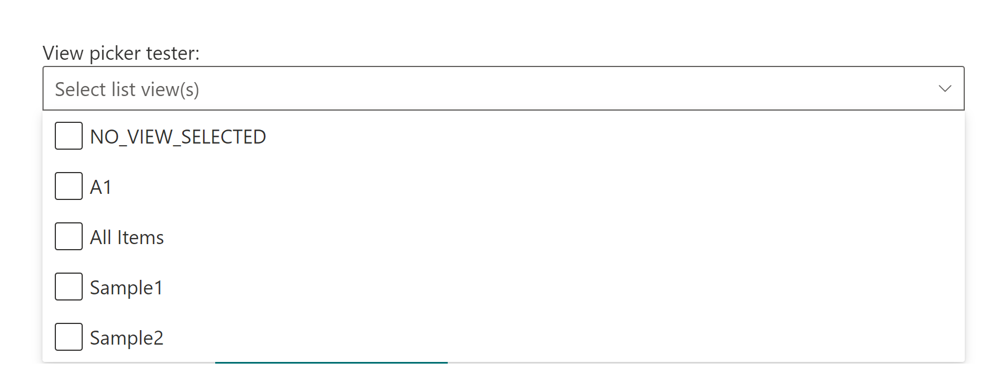

# ViewPicker control

This control allows you to select available views from lists/libraries of the current site.

Here is an example of the control:



`ViewPicker` single selection mode:



`ViewPicker` multi selection mode:



## How to use this control in your solutions

- Check that you installed the `@pnp/spfx-controls-react` dependency. Check out the [getting started](../../#getting-started) page for more information about installing the dependency.
- Import the control into your component:

```TypeScript
import { ViewPicker } from "@pnp/spfx-controls-react/lib/ViewPicker";
```

- Use the `ViewPicker` control in your code as follows:

```TypeScript
    <ViewPicker context={this.props.context}
        listId={"9f3908cd-1e88-4ab3-ac42-08efbbd64ec9"}
        placeholder={'Select list view(s)'}
        orderBy={orderBy.Title}
        multiSelect={true}
        onSelectionChanged={this.onViewPickerChange} />
```

- The `onSelectionChanged` change event returns the selected view(s) and can be implemented as follows in your webpart:

```TypeScript
  private onViewPickerChange = (views: string | string[]) => {
    console.log("Views:", views);
  }
```

## Implementation

The `ViewPicker` control can be configured with the following properties

| Property | Type | Required | Description |
| ---- | ---- | ---- | ---- |
| context | BaseComponentContext | yes | The context object of the SPFx loaded webpart or customizer. |
| className | string | no | If provided, additional class name to provide on the dropdown element. |
| disabled | boolean | no | Whether or not the view picker control is disabled. |
| filter | string | no | Filter views from OData query. |
| label | string | no | Label to use for the control. |
| listId | string | no | The List Id of the list. |
| placeholder | string | no | Placeholder label to show in the dropdown. |
| orderBy | Enum | no | How to order the set of views (By ID or Title). |
| selectedView | string OR string[] | no | Keys(View Ids) of the selected item(s). If you provide this, you must maintain selection state by observing onSelectionChanged events and passing a new value in when changed. |
| multiSelect | boolean | no | Optional mode indicates if multi-choice selections is allowed. Default to `false`. |
| showBlankOption | boolean | no | Whether or not to show a blank option. Default to `false`. |
| viewsToExclude | string[] | no | Defines view titles which should be excluded from the view picker control. |
| webAbsoluteUrl | string | no | Absolute Web Url of target site (user requires permissions) |
| onSelectionChanged | (newValue: string OR string[]): void | no | Callback function when the selected option changes. |

Enum `orderBy`

| Value |
| ----- |
| Id    |
| Title |
