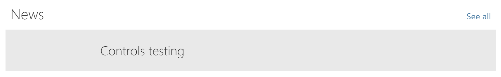

# WebPartTitle: Adding a 'More' link

It is quite common for SharePoint web parts to show a _See all_ option next to the web part title.

You can achieve this look by using the `moreLink` prop.

## The `moreLink` prop

In order to render a hyperlink to the right of the web part title, you must specify the `moreLink` prop of the `WebPartTitle` component.

To do so, you may pass the children elements you wish to render as the _See all_ link, as in the following example code:

```TypeScript
<WebPartTitle displayMode={this.props.displayMode}
              title={this.props.title}
              updateProperty={this.props.updateProperty}
              moreLink={
                <Link href="https://sharepoint.github.io/sp-dev-fx-controls-react/">See all</Link>
              } />
```

If you wish, you may pass a callback function instead, as per the following example code:

```TypeScript
<WebPartTitle displayMode={this.props.displayMode}
              title={this.props.title}
              updateProperty={this.props.updateProperty}
              moreLink={
                ()=> {
                  return (<Link href="https://sharepoint.github.io/sp-dev-fx-controls-react/">See all</Link>);
                }
              } />
```

## The result

The resulting web part title will look like the following:


