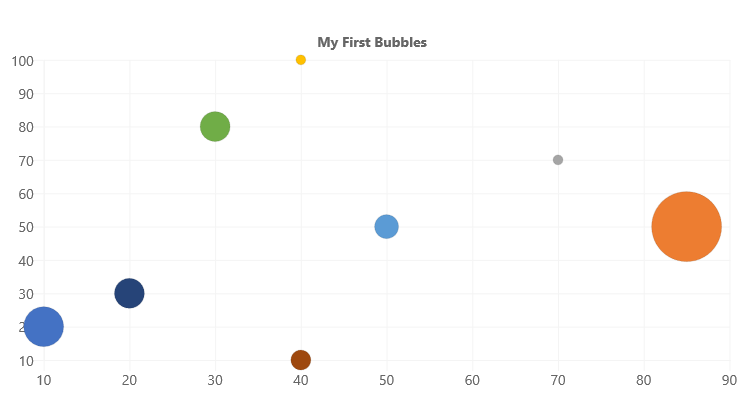

# ChartControl - Bubble Chart

Bubble chart show elements across three dimensions. Each bubble in the chart is located according to the first two dimensions. The size of each bubble represents the third dimension.



## Example Usage

To create a bubble chart, add the ChartControl import:

```TypeScript
import { ChartControl, ChartType } from '@pnp/spfx-controls-react/lib/ChartControl';
```

Then render the ChartControl:

```TypeScript
 <ChartControl
    type={ChartType.Bubble}
    data={data}
    options={options}
  />
```

For example, to render the chart above, use the following code:

```TypeScript
// set the data
const data: Chart.ChartData = {
  datasets: [
    {
      label: "Bubble",
      data:
        [
          { x: 10, y: 20, r: 20 },
          { x: 85, y: 50, r: 35 },
          { x: 70, y: 70, r: 5 },
          { x: 40, y: 100, r: 5 },
          { x: 50, y: 50, r: 12 },
          { x: 30, y: 80, r: 15 },
          { x: 20, y: 30, r: 15 },
          { x: 40, y: 10, r: 10 }
        ]
    }]
};

// set the options
const options: Chart.ChartOptions = {
  legend: {
    display: false
  },
  title: {
    display: true,
    text: "My First Bubbles"
  }
};

return (
  <ChartControl
    type={ChartType.Bubble}
    data={data}
    options={options}
  />);
```

## Dataset Properties

Bubble charts allow each dataset to have different configuration properties.

Some properties can be provided as arrays. When arrays are provided, the settings in the array will be applied to each data element in the same order (e.g.: first value applies to first element, second value to second element, etc.)

| Name                  | Type                                              | Description |
| ----                  | ----                                              | ---- |
| backgroundColor       | Color OR Color[]                                  | The bubble's fill color. Default is `'rgba(0,0,0,0.1)'`. |
| borderColor           | Color OR Color[]                                  | The bubble's border color. Default is `'rgba(0,0,0,0.1)'`. |
| borderWidth           | number OR number[]                                | The width of the bubble's border. Measured in pixels. Default is `3`.|
| data                  | { x: number, y:number, r: number}[] | The data to render. Required. |
| hoverBackgroundColor  | Color OR Color[]                                  | The bubble's background color when a mouse hovers over it. |
| hoverBorderColor      | Color OR Color[]                                  | The bubble's border color when a mouse hovers over it.  |
| hoverBorderWidth      | number OR number[]                                | The bubble's border width when a mouse hovers over it. Default is `1`. |
| hoverRadius      | number OR number[]                                | The bubble's radius when a mouse hovers over it. Default is `4`. |
| hitRadius      | number OR number[]                                | The bubble's radius when a mouse click event occurs. Default is `1`. |
| label         | string  | The dataset's label |
| pointStyle      | `'circle'` <br/>`'cross'`<br/>`'crossRot'`<br/>`'dash'`<br/>`'line'`<br/>`'rect'`<br/>`'rectRounded'`<br/>`'rectRot'`<br/>`'star'`<br/>`'triangle'`<br/>HTMLImageElement<br/>HTMLCanvasElement<br/>HTMLImageElement[]<br/>HTMLCanvasElement[]  | Style of bubble. Default is `'circle'` |
| rotation      | number OR number[]                                | The bubble's rotation, in degrees. Default is `0`. |
| radius      | number OR number[]                                | The bubble's radius. Default is `3`.  |

## Data Structure

The `data` property of each dataset item consists of an `x`, `y`, and `r` coordinate.

```TypeScript
{
    // X Value
    x: number,

    // Y Value
    y: number,

    // Bubble radius in pixels
    r: number
}
```

> **NOTE:** Unlike the `x` and `y`, the `r` value is measured in pixels and does not scale with the chart.

## For More Information

For more information on what options are available with Bubble charts, refer to the [Bubble Chart documentation](https://www.chartjs.org/docs/latest/charts/bubble.html) on [Chart.js](https://www.chartjs.org).


