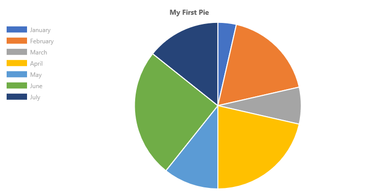
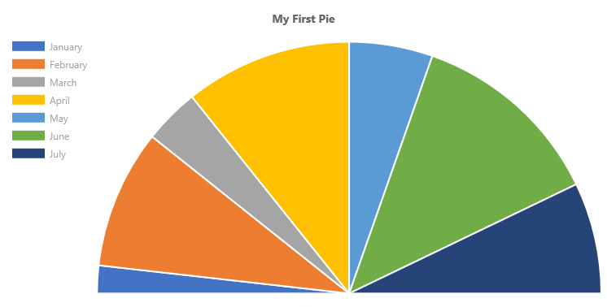
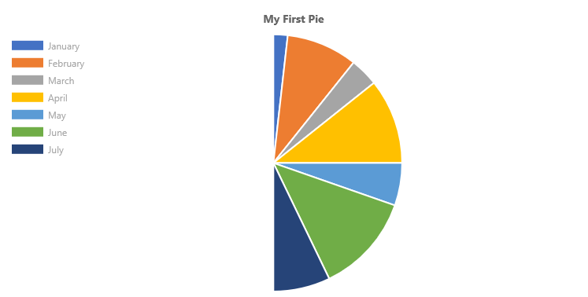
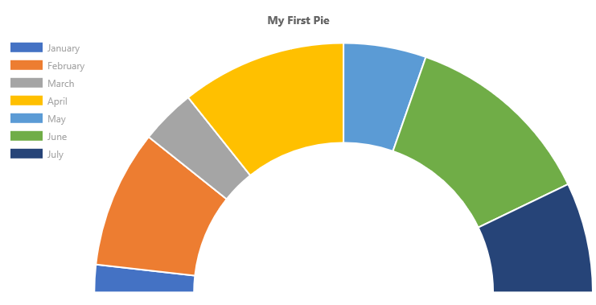

# ChartControl - Pie Chart

Pie charts are divided into segments, each of which shows the proportional value of the data.



## Example Usage

To create a pie chart, add the ChartControl import:

```TypeScript
import { ChartControl, ChartType } from '@pnp/spfx-controls-react/lib/ChartControl';
```

Then render the ChartControl:

```TypeScript
 <ChartControl
    type={ChartType.Pie}
    data={data}
    options={options}
  />
```

For example, to render the chart above, use the following code:

```TypeScript
// set the data
 const data: Chart.ChartData = {
  labels:
    [
      'January', 'February', 'March', 'April', 'May', 'June', 'July'
    ],
  datasets: [
    {
      label: 'My First Dataset',
      data:
        [
          10, 50, 20, 60, 30, 70, 40
        ]
    }
  ]
};

// set the options
const options: Chart.ChartOptions = {
  legend: {
    display: true,
    position: "left"
  },
  title: {
    display: true,
    text: "My First Pie"
  }
};

return (
  <ChartControl
    type={ChartType.Pie}
    data={data}
    options={options}
  />);

```

## Variations

### Half-Moon Pie charts



By default, pie charts (and doughnut charts) render a whole circle. You can change the chart's `circumference` option to render partial circles.

The default `circumference` value is `2 * Math.PI`. To render a half-moon, specify a half value (i.e.: `Math.PI`), as follows:

```TypeScript
 const options: Chart.ChartOptions = {
      circumference: Math.PI,
      legend: {
        display: true,
        position: "left"
      },
      title: {
        display: true,
        text: "My First Pie"
      }
    };
```

Which renders the following half-moon:



To rotate the pie chart 90 degrees to the left, specify a `rotation` value in the chart's options. For example, to render the horizontal half-moon chart shown at the top of this section, use the following options:

```TypeScript
 const options: Chart.ChartOptions = {
      circumference: Math.PI,
      rotation: -1 * Math.PI,
      legend: {
        display: true,
        position: "left"
      },
      title: {
        display: true,
        text: "My First Pie"
      }
    };
```

### Doughnut charts

Technically, doughnut charts and pie charts are derived from the same class in [Chart.js](https://github.com/), where a doughnut chart's `cutoutPercentage` is set to 50.

If you wish to render simple doughnut charts, use the [Doughnut Chart type](./DoughnutChart.md).

However, if you wish to customize how the pie/doughnut chart is rendered, you can set the cutout percentage to a different value.

For example, you can use the following code to render a custom "fuel-gauge" chart:

```TypeScript
 const options: Chart.ChartOptions = {
      circumference: 1 * Math.PI,
      rotation: 1 * Math.PI,
      cutoutPercentage: 60,
      legend: {
        display: true,
        position: "left"
      },
      title: {
        display: true,
        text: "My First Pie"
      }
    };
```

Will produce the following chart:



## Dataset Properties

Pie charts allow each dataset to have different configuration properties.

Properties are provided as arrays. Settings in the array will be applied to each data element in the same order (e.g.: first value applies to first element, second value to second element, etc.)

| Name                 | Type     | Description                                             |
| -------------------- | -------- | ------------------------------------------------------- |
| backgroundColor      | Color[]  | The segment's fill color.                               |
| borderColor          | Color[]  | The segment's border color.                             |
| borderWidth          | number[] | The segment's border width. Measured in pixels.         |
| data                 | number[] | The chart's data. Required.                             |
| hoverBackgroundColor | Color[]  | The segment's fill color when a mouse hovers over it    |
| hoverBorderColor     | Color[]  | The segment's border color when a mouse hovers over it. |
| hoverBorderWidth     | number[] | The segment's border width when a mouse hovers over it. |

## Data Structure

The `data` property of each dataset item consists of an array of numbers. Each point in the array corresponds to the matching label on the x axis:

```TypeScript
data: [20, 10, 33, 47]
```

## Configuration

The following configuration options are specific to pie charts:

| Name                    | Type    | Default        | Description                                                |
| ----------------------- | ------- | -------------- | ---------------------------------------------------------- |
| cutoutPercentage        | number  | 50             | The percentage of the chart that is cut out of the middle. |
| rotation                | number  | -0.5 * Math.PI | The angle at which the pie segments start                  |
| circumference           | number  | 2 * Math.PI    | The total circumference of the donut chart.                |
| animation.animateRotate | boolean | true           | `true` will animate the chart while rotating it.           |
| animation.animateScale  | boolean | false          | `true` will animate the chart while scaling it.            |

## For More Information

For more information on what options are available with Pie charts, refer to the [Doughnut and Pie documentation](https://www.chartjs.org/docs/latest/charts/doughnut.html) on [Chart.js](https://www.chartjs.org).


