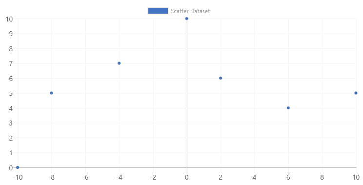
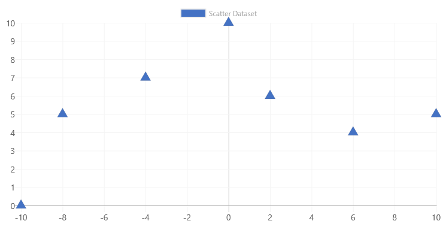
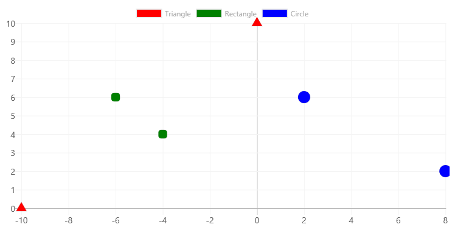

# ChartControl - Scatter Chart

Scatter charts are similar to line charts, except that the X axis (the horizontal axis) uses data values. 

Unlike other charts, scatter charts use `x` and `y` coordinates.



## Example Usage

To create a scatter chart, add the ChartControl import:

```TypeScript
import { ChartControl, ChartType } from '@pnp/spfx-controls-react/lib/ChartControl';
```

Then render the ChartControl:

```TypeScript
 <ChartControl
    type={ChartType.Scatter}
    data={data}
    options={options}
  />
```

For example, to render the chart above, use the following code:

```TypeScript
// set the data
const data: Chart.ChartData = {
  datasets: [{
    label: 'Scatter Dataset',
    data: [
      {
        x: -10,
        y: 0
      },
      {
        x: 0,
        y: 10
      },
      {
        x: 6,
        y: 4
      },
      {
        x: 2,
        y: 6
      },
      {
        x: -4,
        y: 7
      },
      {
        x: -8,
        y: 5
      },
      {
        x: 10,
        y: 5
      }]
  }]
};

// set the options
const options: Chart.ChartOptions = {
  scales: {
    xAxes: [{
      type: 'linear',
      position: 'bottom'
    }]
  }
};

return (
  <ChartControl
    type={ChartType.Scatter}
    data={data}
    options={options}
  />);
```
## Dataset Properties

Scatter charts allow each dataset to have different configuration properties.

Some properties can be provided as arrays. When arrays are provided, the settings in the array will be applied to each data element in the same order (e.g.: first value applies to first element, second value to second element, etc.)

| Name                  | Type                                              | Description |
| ----                  | ----                                              | ---- |
| label                 | string                                            | Dataset label. Appears in the legend and tooltips. |
| xAxisID               | string                                            | The axis ID for the X axis. If not specified, the dataset will be rendered on the first available X axis. If an ID is specified, the dataset will be rendered on that axis |
| yAxisID               | string                                            | The axis ID for the Y axis. If not specified, the dataset will be rendered on the first available Y axis. If an ID is specified, the dataset will be rendered on that axis |
| backgroundColor       | Color OR Color[]                                  | The fill color under the line.  |
| borderColor           | Color OR Color[]                                  | The color of the line.  |
| borderWidth           | number OR number[]                                | The width of the line. Measured in pixels. |
| borderDash            | number[]                                          | The length and spacing of dashes. Consist of an array of numbers that specify distances to alternately draw a line and a gap. If array length is odd, elements of the array will be repeated. If an empty array is provided, lines will be solid. |
| borderDashOffset      | number                                            | The distance to offset dashes. |
| borderCapStyle        | `'butt'`<br/>`'round'`<br/>`'square'`             | Specifies the end of the lines. Default is `'butt`'. |
| borderJoinStyle       | `'bevel'`<br/>`'round'`<br/>`'miter'`             | Determines the shape used to join two line segments where they meet. Default is `'miter'`. |
| cubicInterpolationMode  | `'default'`<br/>`'monotone'`                    | Determins which algorithm is used to interpolate a smooth curve between data points. |
| data | Point[] | The chart's data. Required. |
| fill      | `false`<br/>number<br/>string<br/>`'start'`<br/>`'end'`<br/>`'origin'` | Controls how the dataset's area is filled.  |
| lineTension      | number                                | Ttension of the Bezier curve line. `0` renders straight lines. Ignored if `cubicInterpolationMode` is set to `monotone`.  |
| pointBackgroundColor  | Color OR Color[]                                  | The point's fill color. |
| pointBorderColor      | Color OR Color[]                                  | The point's border color.  |
| pointBorderWidth      | number OR number[]                                | The point's border width.  |
| pointRadius  | number OR number[]                                  | The point's fill color. |
| pointStyle      | `'circle'` <br/>`'cross'`<br/>`'crossRot'`<br/>`'dash'`<br/>`'line'`<br/>`'rect'`<br/>`'rectRounded'`<br/>`'rectRot'`<br/>`'star'`<br/>`'triangle'`<br/>HTMLImageElement<br/>HTMLCanvasElement<br/>HTMLImageElement[]<br/>HTMLCanvasElement[]  | Style of point. |
| pointRotation      | number OR number[]                                | The point's roation, in degrees.  |
| pointHitRadius      | number OR number[]                                | The point's border width.  |
| pointHoverBackgroundColor  | Color OR Color[]                                  | The point's background color when a mouse hovers over it. |
| pointHoverBorderColor      | Color OR Color[]                                  | The point's border color when a mouse hovers over it.  |
| pointHoverBorderWidth      | number OR number[]                                | The point's border width when a mouse hovers over it.  |
| pointHoverRadius      | number OR number[]                                | The point's radius width when a mouse hovers over it.  |
| showLine      | boolean                                | The point's radius width when a mouse hovers over it.  |
| spanGaps      | boolean                                | The point's radius width when a mouse hovers over it.  |
| steppedLine      | boolean<br/>`'before'`<br/>`'after'`| Determines whether the line is shown as a stepped line. Any value but `false` overrides the `lineTension` setting.  |


## Data Structure

The `data` property of each dataset item consists of an array of points. Each point in the array consist of an `x` and `y` coordinate.

```TypeScript
data:
[{
  x: 10,
  y: 20
}, {
  x: 15,
  y: 10
}]
```

#### Point Configuration

Point elements can be configured to change their appearance using the following configuration options:

| Name              | Type    | Default             | Description |
| ----              | ----    | ----                | ---- |
| radius            | number  | 3                   | Point radius. |
| pointStyle        | `'circle'` <br/>`'cross'`<br/>`'crossRot'`<br/>`'dash'`<br/>`'line'`<br/>`'rect'`<br/>`'rectRounded'`<br/>`'rectRot'`<br/>`'star'`<br/>`'triangle'`  | `'circle'`          | Style of point. |
| rotation          | number  | 0                   | Rotation of the point, in degrees. |
| backgroundColor   | Color   | `'rgba(0,0,0,0.1)`  | Fill color.  |
| borderWidth       | number  | 1                   | Stroke width.  |
| borderColor       | Color   | `'rgba(0,0,0,0.1)`  | Stroke color. |
| hitRadius         | number  | 1                   | Extra radius added around the point to make it easier to detect mouse events. |
| hoverRadius       | number  | 4                   | Point radius, when mouse hovers over point. |
| hoverBorderWidth  | number  | 1                   | Stroke width, when mouse hovers over point.  |

You can change the point configuration in the chart via the `options.elements.point` configuration.



For example, to render the above chart, use the following code:

```TypeScript
 const options: Chart.ChartOptions = {
      elements: {
        point: {
          pointStyle: "triangle",
          radius: 10,
          hoverRadius: 15
        }
      },
      scales: {
        xAxes: [{
          type: 'linear',
          position: 'bottom'
        }]
      }
    };
```

You can also control point configurations at the dataset level.
 ```TypeScript
 const data: Chart.ChartData = {
      datasets: [{
        label: 'Triangle',
        data: [
          {
            x: -10,
            y: 0
          },
          {
            x: 0,
            y: 10
          }],
        pointStyle: "triangle",
        backgroundColor: 'red'
      },
      {
        label: 'Rectangle',
        data: [
          {
            x: -6,
            y: 6
          },
          {
            x: -4,
            y: 4
          }],
        pointStyle: "rectRounded",
        backgroundColor: 'green'
      },
      {
         label: 'Circle',
         data: [
           {
            x: 2,
            y: 6
          },
          {
            x: 8,
            y: 2
          }
         ],
        pointStyle: "circle",
        backgroundColor: 'blue'
       }
      ]
    };
 ```

 Which renders the following chart:
 

## For More Information

For more information on what options are available with Scatter charts, refer to the [Scatter documentation](https://www.chartjs.org/docs/latest/charts/scatter.html) on [Chart.js](https://www.chartjs.org).


