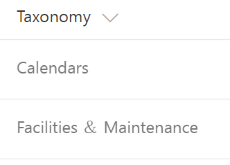

# FieldTaxonomyRenderer control

This control renders terms from Managed Metadata field.



## Covered Fields

- Managed Metadata

## How to use this control in your solutions

- Check that you installed the `@pnp/spfx-controls-react` dependency. Check out the [getting started](../../#getting-started) page for more information about installing the dependency.
- Import the following modules to your component:

```TypeScript
import { FieldTaxonomyRenderer } from "@pnp/spfx-controls-react/lib/FieldTaxonomyRenderer";
```

- Use the `FieldTaxonomyRenderer` control in your code as follows:

```TypeScript
<FieldTaxonomyRenderer terms={event.fieldValue} className={'some-class'} cssProps={{ background: '#f00' }} />
```

## Implementation

The FieldTaxonomyRenderer component can be configured with the following properties:

| Property  | Type                | Required | Description                           |
| --------- | ------------------- | -------- | ------------------------------------- |
| cssProps  | React.CSSProperties | no       | CSS styles to apply to the renderer.  |
| className | ICssInput           | no       | CSS classes to apply to the renderer. |
| terms     | ITerm[]             | yes      | Managed Metadata terms.               |


