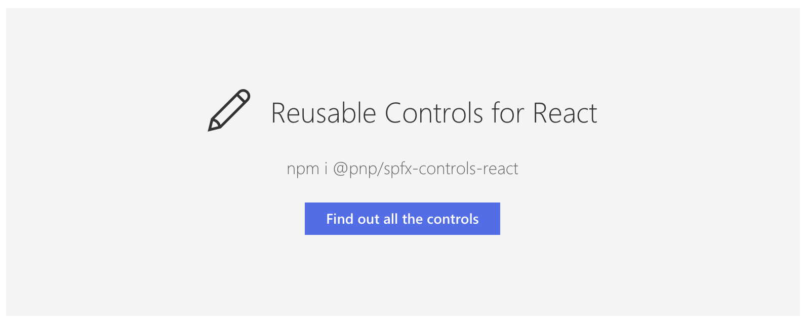

# Reusable React controls for your SharePoint Framework solutions 

This repository provides developers with a set of reusable React controls that can be used in SharePoint Framework (SPFx) solutions. The project provides controls for building web parts and extensions.



!!! attention
    The controls project has a minimal dependency on SharePoint Framework version `1.3.0`. Be aware that the controls might not work in solutions your building for on-premises. As for on-premises solutions version `1.1.0` is currently used.

## Getting started

### Installation

To get started you have to install the following dependency to your project: `@pnp/spfx-controls-react`.

Enter the following command to install the dependency to your project:

```bash
npm install @pnp/spfx-controls-react --save --save-exact
```

### Configuration

!!! note
    Since `v1.4.0` the localized resource path will automatically be configured during the dependency installing.

Once the package is installed, you will have to configure the resource file of the property controls to be used in your project. You can do this by opening the `config/config.json` and adding the following line to the `localizedResources` property:

```json
"ControlStrings": "node_modules/@pnp/spfx-controls-react/lib/loc/{locale}.js"
```

## Available controls

The following controls are currently available:

- [FileTypeIcon](./controls/FileTypeIcon) (Control that shows the icon of a specified file path or application)
- [ListView](./controls/ListView) (List view control)
- [Placeholder](./controls/Placeholder) (Control that can be used to show an initial placeholder if the web part has to be configured)
- [SiteBreadcrumb](./controls/SiteBreadcrumb) (Breadcrumb control)
- [TaxonomyPicker](./controls/TaxonomyPicker) (Taxonomy Picker)
- [PeoplePicker](./controls/PeoplePicker) (People Picker)
- [WebPartTitle](./controls/WebPartTitle) (Customizable web part title control)
- [IFrameDialog](./controls/IFrameDialog) (renders a Dialog with an iframe as a content)

Field customizer controls:

!!! note
    If you want to use these controls in your solution, first check out the start guide for these controls: [using the field controls](./controls/fields/main).

- [FieldAttachmentsRenderer](./controls/fields/FieldAttachmentsRenderer) (renders Clip icon based on the provided `count` property is defined and greater than 0)
- [FieldDateRenderer](./controls/fields/FieldDateRenderer) (renders date string as a simple text)
- [FieldFileTypeRenderer](./controls/fields/FieldFileTypeRenderer) (renders document or folder icon based on file path)
- [FieldLookupRenderer](./controls/fields/FieldLookupRenderer) (renders lookup values)
- [FieldNameRenderer](./controls/fields/FieldNameRenderer) (renders document's name as a link)
- [FieldTaxonomyRenderer](./controls/fields/FieldTaxonomyRenderer) (renders terms from Managed Metadata field)
- [FieldTextRenderer](./controls/fields/FieldTextRenderer) (renders simple text)
- [FieldTitleRenderer](./controls/fields/FieldTitleRenderer) (renders title either as a simple text or as a link to the Display Form)
- [FieldUrlRenderer](./controls/fields/FieldUrlRenderer) (renders Hyperlink or Picture field value as a link or image)
- [FieldUserRenderer](./controls/fields/FieldUserRenderer) (renders each referenced user/group as a link on a separate line)


